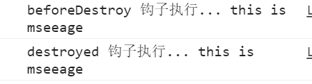

## 一. VueCli环境

### 1. 环境准备

1. #### 脚手架运行环境

   1）Node.js运行环境；

   2）npm（node package manage）依赖包

2. #### 脚手架的好处：

   1）脚手架可以大大的提高开发效率；

   2）可使用最主流的ECMAScript语法；

   3）通过webpack实现编译查看效果（非浏览器编译）；

   4）自动更新，可实时查看最新效果等；

3. #### 依赖安装

   ```shell
   // 安装脚手架
   npm install -g @vue/cli
   // 查看版本
   vue --version
   ```

### 2. 项目搭建

#### 	1.手动创建项目

```shell
// 打开cmd或者powershell，跳转至E盘
e:
cd E:\demoprojects
// 创建名为demo的vuecli项目
vue create demo
```



```
// 使用命令启动项目验证是否成功
npm run serve
```

#### 2.使用HBuilderx创建项目

使用HbuilderX创建一个vue-cli默认项目，操作步骤如下：

​	a. 打开HbuilderX，点击“文件 ---> 新建 ---> 项目”

​	b. 在选择模板中选择“vue项目(2.6.10) ”


创建完成后的目录结构如下所示：


### 3. 目录介绍

- node_modules：项目运行所需的依赖包仓库
- public：项目静态资源路径，编译时不会被webpack处理
- src：代码放置路径，其中包含assets目录用于放置项目所需img、js、css，编译时会被webpack处理
- .gitignore：提交git的配置文件
- babel.config.js： ES6转ES5转码器配置文件
- package.json：应用设置及相关依赖、脚本的设置

**package.json**

```javascript
{
  "name": "demo", // 应用名称
  "version": "0.1.0", //版本号
  "private": true,
  "scripts": { // 自定义脚本，可使用 npm run 来调用，等价于冒号之后的命令
    "serve": "vue-cli-service serve", // 运行
    "build": "vue-cli-service build", //编译
    "lint": "vue-cli-service lint" // 检查
  },
  "dependencies": { // 核心依赖
    "core-js": "^3.6.5",
    "vue": "^2.6.11"
  },
  "devDependencies": { // 开发环境依赖，生产环境不启用
    "@vue/cli-plugin-babel": "~4.5.0",
    "@vue/cli-plugin-eslint": "~4.5.0",
    "@vue/cli-service": "~4.5.0",
    "babel-eslint": "^10.1.0",
    "eslint": "^6.7.2",
    "eslint-plugin-vue": "^6.2.2",
    "vue-template-compiler": "^2.6.11"
  },
  "eslintConfig": { // eslint配置
    "root": true,
    "env": {
      "node": true
    },
    "extends": [
      "plugin:vue/essential",
      "eslint:recommended"
    ],
    "parserOptions": { 
      "parser": "babel-eslint"
    },
    "rules": {}
  },
  "browserslist": [ // 浏览器兼容性设置
    "> 1%",
    "last 2 versions",
    "not dead"
  ]
}
```


## 二. vue介绍

​	Vue.js是一套用于构建用户界面的**渐进式框架**，是一套轻量级MVVM框架

​	MVVM（Model-View-ViewModel）模式将数据双向绑定（data-binding）作为核心思想，View 和 Model 之间没有联系，它们通过 ViewModel 这个桥梁进行交互。

	『View』：视图层（UI 用户界面）
	『ViewModel』：业务逻辑层（一切 js 可视为业务逻辑）
	『Model』：数据层（存储数据及对数据的处理如增删改查）


**Vue.js的优点** 

1. 简单轻巧，功能强大，拥有非常容易上手的 API；

2. 可组件化 和 响应式设计；

3. 实现数据与结构分离，高性能，易于浏览器的加载速度；

   基于虚拟dom，一种可以预先通过JavaScript进行各种计算，把最终的DOM操作计算出来并优化的技术，由于这个DOM操作属于预处理操作，并没有真实的操作DOM，所以叫做虚拟DOM

4. MVVM 模式，数据双向绑定，减少了 DOM 操作，将更多精力放在数据和业务逻辑上。


## 三. vue实例

### 1.创建实例

​	Vue.js 的核心是一个允许采用简洁的模板语法来声明式地将数据渲染进 DOM 的系统：

```html
<template>
  <div id="app">
    <h1>{{msg}}</h1>
  </div>
</template>
```

```js
// 导出当前vue实例
export default {
  name: 'app',
  data(){
	 return {
		 msg: 'hello'
	 }
  }
}
```

### 2.属性和方法

当一个 Vue 实例被创建时，它将 `data` 对象中的所有的 property 加入到 Vue 的**响应式系统**中。当这些 property 的值发生改变时，视图将会产生“响应”，即匹配更新为新的值

```javascript
// 我们的数据对象
var data = { a: 1 }

// 该对象被加入到一个 Vue 实例中
export default {
  name: 'app',
  data(){
	 return data
  }
}

// 获得这个实例上的 property
// 返回源数据中对应的字段
// 在export default 中使用this，在这里的含义即该vue实例
this.a == data.a // => true

// 设置 property 也会影响到原始数据
this.a = 2
data.a // => 2

// ……反之亦然
data.a = 3
this.a // => 3
```

**注意：**

 1. 只有当实例被创建时就已经存在于data 中的属性才是**响应式**的。也就是说如果你在创建实例后添加一个新的属性，比如：

    ```html
    <template>
      <div id="app">
        <h1>{{b}}</h1>
      </div>
    </template>
    ```

    ```js
    export default {
      name: 'app',
      data(){
    	 return {} // 未声明任何属性（变量）
      },
      created(){  // Vue实例被创建后，调用的钩子函数
        // 在实例被创建之后声明使用b
    	// b 的改动将不会触发任何视图的更新
    	this.b = 'hi';
    	setTimeout(()=>{
    		this.b = '12';
    	},2000)
      }
    }
    ```

    **注意：**

    1. 如果存在实例创建前声明的变量，比如a。当a在b改变之后，发生改变，视图重新渲染，会将b的值进行更新。

    2. 如果你知道你会在晚些时候需要一个 property，但是一开始它为空或不存在，那么你仅需要设置一些初始值

    ```js
    data(){
    	return {
            newTodoText: '',
            visitCount: 0,
            hideCompletedTodos: false,
            todos: [],
            error: null
        }
    }
    ```

2. 除了数据属性，Vue实例还暴露了一些有用的实例属性与方法。它们都有前缀 $，以便与用户定义的属性区分开来

   ```javascript
   var data = { a: 1 }
   // 该对象被加入到一个 Vue 实例中
   export default {
     name: 'app',
     data(){
   	 return data
     },
     created(){  // Vue实例被创建后，调用的钩子函数
       this.$data === data // => true
   
   	// $watch 是一个实例方法
   	this.$watch('a', function (newValue, oldValue) {
     		// 这个回调将在 `vm.a` 改变后调用
   	})
     }
   }
   ```

   1. 实例属性

   

   2. 实例方法

   


## 四. 模板语法

​	Vue.js 使用了基于 HTML 的模板语法，允许开发者声明式地将 DOM 绑定至底层 Vue 实例的数据。所有 Vue.js 的模板都是合法的 HTML，所以能被遵循规范的浏览器和 HTML 解析器解析。

​	在底层的实现上，Vue 将模板编译成虚拟 DOM 渲染函数。结合响应系统，Vue 能够智能地计算出最少需要重新渲染多少组件，并把 DOM 操作次数减到最少。

#### 1.插值

1. 文本

   数据绑定最常见的形式就是使用“Mustache”语法 (双大括号) 的文本插值：

   ```html
   <span>Message: {{ msg }}</span>
   <!-- Mustache 标签将会被替代为对应数据对象上msg属性的值。无论何时，绑定的数据对象上sg属性发生了改变，插值处的内容都会更新。 -->
   
   <span v-once>这个将不会改变: {{ msg }}</span>
   <!-- 通过使用 v-once 指令，你也能执行一次性地插值，当数据改变时，插值处的内容不会更新。-->
   <!-- 但请留心这会影响到该节点上的其它数据绑定-->
   ```

2. 原始HTML

   双大括号会将数据解释为普通文本，而非 HTML 代码。为了输出真正的 HTML，你需要使用v-html指令

   ```html
   <!-- rawHtml : '<span style="color:red">this is should be red</span>' -->
   <p>Using mustaches: {{ rawHtml }}</p>
   <p>Using v-html directive: <span v-html="rawHtml"></span></p>
   ```

3. dom元素（标签）自带的属性

   Mustache 语法（双大括号形式）不能作用在 HTML标签元素自带的属性上，遇到这种情况应该使用v-bind指令

   ```html
   <div v-bind:id="dynamicId"></div>
   
   <!-- 对于布尔标签自带属性(它们只要存在就意味着值为true)，v-bind效果略有不同-->
   <!-- 如果isButtonDisabled的值是null、undefined或false，
   	则disabled属性甚至不会被包含在渲染出来的 <button>元素中 -->
   <button v-bind:disabled="isButtonDisabled">Button</button>
   
   ```

4. JavaScript表达式

   对于所有的数据绑定，Vue.js 都提供了完全的 JavaScript 表达式支持。

   ```html
   {{ number + 1 }}
   
   {{ ok ? 'YES' : 'NO' }}
   
   {{ message.split('').reverse().join('') }}
   
   <div v-bind:id="'list-' + id"></div>
   <!-- 这些表达式会在所属 Vue 实例的数据作用域下作为 JavaScript 被解析。 -->
   <!-- 有个限制就是，每个绑定都只能包含单个表达式，所以下面的例子都不会生效。-->
   
   <!-- 这是语句，不是表达式 -->
   {{ var a = 1 }}
   
   <!-- 流控制也不会生效，请使用三元表达式 -->
   {{ if (ok) { return message } }}
   ```

#### 2.指令

指令 (Directives) 是带有 `v-` 前缀的特殊 attribute。指令 attribute 的值预期是**单个 JavaScript 表达式** (v-for是例外情况)。指令的职责是，当表达式的值改变时，将其产生的连带影响，响应式地作用于 DOM。

```html
<p v-if="seen">现在你看到我了</p>

<!-- <p v-if="seen">现在你看到我了</p> -->
```

1. 参数

   一些指令能够接收一个“参数”，在指令名称之后以冒号表示。

   ```html
   <!-- 例一： v-bind指令可以用于响应式地更新 HTML 标签自带属性 -->
   <!-- 在这里 href 是参数，告知 v-bind 指令将该元素的 href attribute 与表达式 url 的值绑定。-->
   <a v-bind:href="url">...</a>
   
   <!-- 例子二：v-on指令，它用于监听 DOM 事件：-->
   <!-- 参数是监听的事件名 -->
   <a v-on:click="doSomething">...</a>
   ```

2. 动态参数

   从 2.6.0 开始，可以用方括号括起来的 JavaScript 表达式作为一个指令的参数：

   ```html
   <!-- 注意，参数表达式的写法存在一些约束 -->
   <!-- 这里的 attributeName 会被作为一个 JavaScript 表达式进行动态求值，求得的值将会作为最终的参数来使用。例如，如果你的 Vue 实例有一个 data property attributeName，其值为 "href"，那么这个绑定将等价于 v-bind:href。-->
   <a v-bind:[attributeName]="url"> ... </a>
   
   <!-- 使用动态参数为一个动态的事件名绑定处理函数 -->
   <!-- 在这个示例中，当 eventName 的值为 "focus" 时，v-on:[eventName] 将等价于 v-on:focus。-->
   <a v-on:[eventName]="doSomething"> ... </a>
   ```

3. 缩写

   `v-` 前缀作为一种视觉提示，用来识别模板中 Vue 特定的 attribute。当你在使用 Vue.js 为现有标签添加动态行为 (dynamic behavior) 时，`v-` 前缀很有帮助，然而，对于一些频繁用到的指令来说，就会感到使用繁琐。同时，在构建由 Vue 管理所有模板的单页面应用程序 (SPA - single page application)时，`v-` 前缀也变得没那么重要了。因此，Vue 为 `v-bind` 和 `v-on` 这两个最常用的指令，提供了特定简写：

   1. v-bind缩写

      ```html
      <!-- 完整语法 -->
      <a v-bind:href="url">...</a>
      
      <!-- 缩写 -->
      <a :href="url">...</a>
      
      <!-- 动态参数的缩写 (2.6.0+) -->
      <a :[key]="url"> ... </a>
      ```

   2. v-on缩写

      ```html
      <!-- 完整语法 -->
      <a v-on:click="doSomething">...</a>
      
      <!-- 缩写 -->
      <a @click="doSomething">...</a>
      
      <!-- 动态参数的缩写 (2.6.0+) -->
      <a @[event]="doSomething"> ... </a>
      ```


#### 3. 双向数据绑定

​	 v-model 指令在**表单**控件元素（ `select`、`textarea` 、`input`等）上创建双向数据绑定

特点：

1. 根据控件类型自动选取正确的方法来更新元素

   ```html
   <!-- 文本 -->
   <input v-model="message" placeholder="edit me">
   <!-- 本质 -->
   <input :value="message" @input="message=$event.target.value">
   <p>Message is: {{ message }}</p>
   
   <!-- 多行文本 -->
   <textarea v-model="message" placeholder="add multiple lines"></textarea>
   
   <!-- 复选框 -->
   <!-- 单个复选框，绑定布尔值 -->
   <input type="checkbox" id="checkbox" v-model="checked">
   <label for="checkbox">{{ checked }}</label>
   <!-- 多个复选框，绑定到同一数组 -->
   <input type="checkbox" id="jack" value="Jack" v-model="checkedNames">
   <label for="jack">Jack</label>
   <input type="checkbox" id="john" value="John" v-model="checkedNames">
   <label for="john">John</label>
   
   <!-- 单选按钮 -->
   <!-- v-model上绑定同一值 会让单选框互斥，可以不用name属性 -->
   <div id="example">
     <input type="radio" id="one" value="One" v-model="picked">
     <label for="one">One</label>
     <br>
     <input type="radio" id="two" value="Two" v-model="picked">
     <label for="two">Two</label>
     <br>
     <span>Picked: {{ picked }}</span>
   </div>
   
   <!-- 选择框 -->
   <!-- option的value值可以为对象-->
   <!-- 单选（绑定值） -->
   <div id="example">
     <select v-model="selected">
       <option disabled value="">请选择</option>
       <option>A</option>
       <option>B</option>
       <option>C</option>
     </select>
     <span>Selected: {{ selected }}</span>
   </div>
   <!-- 多选（绑定数组） -->
   <div id="example">
     <select v-model="selected" multiple style="width: 50px;">
       <option>A</option>
       <option>B</option>
       <option>C</option>
     </select>
     <br>
     <span>Selected: {{ selected }}</span>
   </div>
   ```

2. `v-model` 在内部为不同的输入元素使用不同的属性并抛出不同的事件

   1. text和textarea元素使用value属性和input事件
   2. checkbox和radio使用checked属性和change事件
   3. select使用value属性和change事件

 注意：

​	1. v-model 会忽略表单控件元素自带的属性设定的默认值，如selected、value、checked

## 五. 计算属性

### 计算属性

模板内的表达式非常便利，但是设计它们的初衷是用于简单运算的。在模板中放入太多的逻辑会让模板过重且难以维护。例如：

```vue
<div id="example">
  {{ message.split('').reverse().join('') }}
</div>
```

在这个地方，模板不再是简单的声明式逻辑。你必须看一段时间才能意识到，这里是想要显示变量 `message` 的翻转字符串。当你想要在模板中的多处包含此翻转字符串时，就会更加难以处理。

所以，对于任何复杂逻辑，你都应当使用**计算属性**。

#### 基础例子

```vue
<div id="example">
  <p>Original message: "{{ message }}"</p>
  <p>Computed reversed message: "{{ reversedMessage }}"</p>
</div>
var vm = new Vue({
  el: '#example',
  data: {
    message: 'Hello'
  },
  computed: {
    // 计算属性的 getter
    reversedMessage: function () {
      // `this` 指向 vm 实例
      return this.message.split('').reverse().join('')
    }
  }
})
```

结果：

Original message: "Hello"

Computed reversed message: "olleH"

这里我们声明了一个计算属性 `reversedMessage`。我们提供的函数将用作 property `vm.reversedMessage` 的 getter 函数：

```js
console.log(vm.reversedMessage) // => 'olleH'
vm.message = 'Goodbye'
console.log(vm.reversedMessage) // => 'eybdooG'
```

你可以打开浏览器的控制台，自行修改例子中的 vm。`vm.reversedMessage` 的值始终取决于 `vm.message` 的值。

你可以像绑定普通 property 一样在模板中绑定计算属性。Vue 知道 `vm.reversedMessage` 依赖于 `vm.message`，因此当 `vm.message` 发生改变时，所有依赖 `vm.reversedMessage` 的绑定也会更新。而且最妙的是我们已经以声明的方式创建了这种依赖关系：计算属性的 getter 函数是没有副作用 (side effect) 的，这使它更易于测试和理解。

#### 计算属性缓存 vs 方法

你可能已经注意到我们可以通过在表达式中调用方法来达到同样的效果：

```js
<p>Reversed message: "{{ reversedMessage() }}"</p>
// 在组件中
methods: {
  reversedMessage: function () {
    return this.message.split('').reverse().join('')
  }
}
```

我们可以将同一函数定义为一个方法而不是一个计算属性。两种方式的最终结果确实是完全相同的。然而，不同的是**计算属性是基于它们的响应式依赖进行缓存的**。只在相关响应式依赖发生改变时它们才会重新求值。这就意味着只要 `message` 还没有发生改变，多次访问 `reversedMessage` 计算属性会立即返回之前的计算结果，而不必再次执行函数。

这也同样意味着下面的计算属性将不再更新，因为 `Date.now()` 不是响应式依赖：

```js
computed: {
  now: function () {
    return Date.now()
  }
}
```

相比之下，每当触发重新渲染时，调用方法将**总会**再次执行函数。

我们为什么需要缓存？假设我们有一个性能开销比较大的计算属性 **A**，它需要遍历一个巨大的数组并做大量的计算。然后我们可能有其他的计算属性依赖于 **A**。如果没有缓存，我们将不可避免的多次执行 **A** 的 getter！如果你不希望有缓存，请用方法来替代。

#### 计算属性 vs 侦听属性

Vue 提供了一种更通用的方式来观察和响应 Vue 实例上的数据变动：**侦听属性**。当你有一些数据需要随着其它数据变动而变动时，你很容易滥用 `watch`——特别是如果你之前使用过 AngularJS。然而，通常更好的做法是使用计算属性而不是命令式的 `watch` 回调。细想一下这个例子：

```vue
<div id="demo">{{ fullName }}</div>
var vm = new Vue({
  el: '#demo',
  data: {
    firstName: 'Foo',
    lastName: 'Bar',
    fullName: 'Foo Bar'
  },
  watch: {
    firstName: function (val) {
      this.fullName = val + ' ' + this.lastName
    },
    lastName: function (val) {
      this.fullName = this.firstName + ' ' + val
    }
  }
})
```

上面代码是命令式且重复的。将它与计算属性的版本进行比较：

```js
var vm = new Vue({
  el: '#demo',
  data: {
    firstName: 'Foo',
    lastName: 'Bar'
  },
  computed: {
    fullName: function () {
      return this.firstName + ' ' + this.lastName
    }
  }
})
```

好得多了，不是吗？

#### 计算属性的 setter

计算属性默认只有 getter，不过在需要时你也可以提供一个 setter：

```js
// ...
computed: {
  fullName: {
    // getter
    get: function () {
      return this.firstName + ' ' + this.lastName
    },
    // setter
    set: function (newValue) {
      var names = newValue.split(' ')
      this.firstName = names[0]
      this.lastName = names[names.length - 1]
    }
  }
}
// ...
```

现在再运行 `vm.fullName = 'John Doe'` 时，setter 会被调用，`vm.firstName` 和 `vm.lastName` 也会相应地被更新。

### 侦听器

虽然计算属性在大多数情况下更合适，但有时也需要一个自定义的侦听器。这就是为什么 Vue 通过 `watch` 选项提供了一个更通用的方法，来响应数据的变化。当需要在数据变化时执行异步或开销较大的操作时，这个方式是最有用的。

例如：

```html
<div id="watch-example">
  <p>
    Ask a yes/no question:
    <input v-model="question">
  </p>
  <p>{{ answer }}</p>
</div>
<!-- 因为 AJAX 库和通用工具的生态已经相当丰富，Vue 核心代码没有重复 -->
<!-- 提供这些功能以保持精简。这也可以让你自由选择自己更熟悉的工具。 -->
<script src="https://cdn.jsdelivr.net/npm/axios@0.12.0/dist/axios.min.js"></script>
<script src="https://cdn.jsdelivr.net/npm/lodash@4.13.1/lodash.min.js"></script>
<script>
var watchExampleVM = new Vue({
  el: '#watch-example',
  data: {
    question: '',
    answer: 'I cannot give you an answer until you ask a question!'
  },
  watch: {
    // 如果 `question` 发生改变，这个函数就会运行
    question: function (newQuestion, oldQuestion) {
      this.answer = 'Waiting for you to stop typing...'
      this.debouncedGetAnswer()
    }
  },
  created: function () {
    // `_.debounce` 是一个通过 Lodash 限制操作频率的函数。
    // 在这个例子中，我们希望限制访问 yesno.wtf/api 的频率
    // AJAX 请求直到用户输入完毕才会发出。想要了解更多关于
    // `_.debounce` 函数 (及其近亲 `_.throttle`) 的知识，
    // 请参考：https://lodash.com/docs#debounce
    this.debouncedGetAnswer = _.debounce(this.getAnswer, 500)
  },
  methods: {
    getAnswer: function () {
      if (this.question.indexOf('?') === -1) {
        this.answer = 'Questions usually contain a question mark. ;-)'
        return
      }
      this.answer = 'Thinking...'
      var vm = this
      axios.get('https://yesno.wtf/api')
        .then(function (response) {
          vm.answer = _.capitalize(response.data.answer)
        })
        .catch(function (error) {
          vm.answer = 'Error! Could not reach the API. ' + error
        })
    }
  }
})
</script>
```

结果：

Ask a yes/no question: 

I cannot give you an answer until you ask a question!

在这个示例中，使用 `watch` 选项允许我们执行异步操作 (访问一个 API)，限制我们执行该操作的频率，并在我们得到最终结果前，设置中间状态。这些都是计算属性无法做到的。

## 六. 样式绑定

​	操作元素的 class 列表和内联样式是数据绑定的一个常见需求。因为它们都是标签自带属性，所以我们可以用 `v-bind` 处理它们：只需要通过表达式计算出字符串结果即可。不过，字符串拼接麻烦且易错。因此，在将 `v-bind` 用于 `class` 和 `style` 时，Vue.js 做了专门的增强。表达式结果的类型除了字符串之外，还可以是**对象或数组**。

1. **绑定 HTML Class**

   1. **对象语法**

      可以传给 v-bind:class 一个对象，以动态地切换 class：

      ```vue
      <template>
        <div class="hello">
           <div v-bind:class="{ active: isActive }">背景色</div>
           <div v-bind:class="{ active: isActive,div_circle: isCircle }">背景色/圆</div>
           <div class = "fontSize20"
                v-bind:class="{ active: isActive,div_circle: isCircle }">背景色/圆</div>
            <div v-bind:class="styleObj">对象传值</div>
        </div>
      </template>
      
      <script>
      export default {
        name: 'HelloWorld',
        props: {
          msg: String
        },
        data(){
      	return {
      		isActive:true,
      		isCircle:true,
      		active:'active',
              styleObj:{ active: false,div_circle: true },
      	}  
        },
      }
      </script>
      
      <!-- 添加 "scoped" 属性，可以限制CSS只在该组件起效果 -->
      <style scoped>
      	.active{
      		background-color: #adadda;
      	}
      	.div_circle{
      		width: 200px;
      		height: 200px;
      		border-radius: 50%;
      		border: 2px solid #D19A66;
      		line-height: 200px;
      		text-align: center;
      	}
      	.div_box{
      		width: 200px;
      		height: 200px;
      		border: 2px dashed #D3869B;
      		line-height: 200px;
      		text-align: center;
      	}
          .fontSize20{
              font-size: 20px;
          }
      </style>
      ```

   2. **数组语法**

      可以把一个数组传给 `v-bind:class`，以应用一个 class 列表

      ```vue
      <template>
        <div class="hello">
         <div v-bind:class="[ active,'div_box']">背景色/方形</div>
         <div v-bind:class="[ active, isActive ? 'div_circle': 'div-box']">背景色/圆</div>
         <div v-bind:class="[ {active:true}, isActive ? 'div_circle': 'div-box']">背景色/圆</div>
        </div>
      </template>
      
      <script>
      export default {
        name: 'HelloWorld',
        props: {
          msg: String
        },
        data(){
      	return {
      		isActive:true,
      		isCircle:true,
      		active:'active',
      	}  
        },
      }
      </script>
      
      <!-- 添加 "scoped" 属性，可以限制CSS只在该组件起效果 -->
      <style scoped>
      	.active{
      		background-color: #adadda;
      	}
      	.div_circle{
      		width: 200px;
      		height: 200px;
      		border-radius: 50%;
      		border: 2px solid #D19A66;
      		line-height: 200px;
      		text-align: center;
      	}
      	.div_box{
      		width: 200px;
      		height: 200px;
      		border: 2px dashed #D3869B;
      		line-height: 200px;
      		text-align: center;
      	}
      </style>
      ```

2. **绑定内联样式**

   1. **对象语法**

      `v-bind:style`的对象语法十分直观——看着非常像 CSS，但其实是一个 JavaScript 对象。CSS属性名可以用驼峰式 (camelCase) 或短横线分隔 (kebab-case，记得用引号括起来) 来命名：

      ```html
      <div v-bind:style="{ color: activeColor, fontSize: fontSize + 'px' }"></div>
      <!--
          data: {
            activeColor: 'red',
            fontSize: 30
          }
      -->
      
      <!-- 绑定到一个样式对象-->
      <div v-bind:style="styleObject"></div>
      <!--
          data: {
            styleObject: {
              color: 'red',
              fontSize: '13px'
            }
          }
      -->
      ```

   2. **数组语法**

      `v-bind:style` 的数组语法可以将多个样式对象应用到同一个元素上

      ```html
      <template>
        <div class="hello">
         <div v-bind:class="[ active,'div_box']">样式绑定——背景色/方形</div>
         <div v-bind:class="[ active, isActive ? 'div_circle': 'div-box']">样式绑定——背景色/圆形</div>
        </div>
      </template>
      
      <script>
      export default {
        name: 'HelloWorld',
        props: {
          msg: String
        },
        data(){
      	return {
      		isActive:true,
      		isCircle:true,
      		active:'active',
      	}  
        },
      }
      </script>
      
      <!-- 添加 "scoped" 属性，可以限制CSS只在该组件起效果 -->
      <style scoped>
      	.active{
      		background-color: #adadda;
      	}
      	.div_circle{
      		width: 200px;
      		height: 200px;
      		border-radius: 50%;
      		border: 2px solid #D19A66;
      		line-height: 200px;
      		text-align: center;
      	}
      	.div_box{
      		width: 200px;
      		height: 200px;
      		border: 2px dashed #D3869B;
      		line-height: 200px;
      		text-align: center;
      	}
      </style>
      ```


## 七. 条件渲染

1. v-if 指令

​	`v-if` 指令用于条件性地渲染一块内容。这块内容只会在指令的表达式返回真值的时候被渲染。

```html
<h1 v-if="awesome">Vue is awesome!</h1>

<!-- v-else 添加一个“else 块” -->
<!-- v-else 元素必须紧跟在带 v-if 或者 v-else-if 的元素的后面，否则它将不会被识别 -->
<h1 v-if="awesome">Vue is awesome!</h1>
<h1 v-else>Oh no</h1>

<!-- v-else-if 添加一个“else if 块” -->
<!-- 类似于 v-else，v-else-if 也必须紧跟在带 v-if 或者 v-else-if 的元素之后 -->
<div v-if="type === 'A'">
  A
</div>
<div v-else-if="type === 'B'">
  B
</div>
<div v-else-if="type === 'C'">
  C
</div>
<div v-else>
  Not A/B/C
</div>
```

2. v-show 指令

   另一个用于根据条件展示元素的选项是 `v-show` 指令。用法大致一样，不同的是带有 `v-show` 的元素始终会被渲染并保留在 DOM 中。**`v-show` 只是简单地切换元素的 CSS `display`属性。**

   ```html
   <!-- v-show 不支持 <template> 元素，也不支持 v-else -->
   <h1 v-show="ok">Hello!</h1>
   ```

3. v-if vs v-show

   ​	v-if` 是“真正”的条件渲染，因为它会确保在切换过程中条件块内的事件监听器和子组件适当地被销毁和重建。

   ​	`v-if` 也是**惰性的**：如果在初始渲染时条件为假，则什么也不做——直到条件第一次变为真时，才会开始渲染条件块。

   ​	相比之下，`v-show` 就简单得多——不管初始条件是什么，元素总是会被渲染，并且只是简单地基于 CSS 进行切换。

   ​	一般来说，`v-if` 有更高的切换开销，而 `v-show` 有更高的初始渲染开销。因此，如果需要非常频繁地切换，则使用 `v-show` 较好；如果在运行时条件很少改变，则使用 `v-if` 较好。


## 八. 列表渲染

​	我们可以用 `v-for` 指令基于一个数组来渲染一个列表。`v-for` 指令需要使用 `item in items` 形式的特殊语法，其中 `items` 是**源数据数组**，而 `item` 则是被迭代的数组元素的**别名**。

```html
<ul>
    for 
  <li v-for="item in items" :key="item.message">
    {{ item.message }}
  </li>
</ul>
```

```js
export default {
  name: 'app',
  data(){
	 return {
     	items: [
      		{ message: 'Foo' },
      		{ message: 'Bar' }
        ]
     }
  },
}
```

`v-for` 还支持一个可选的第二个参数，即当前项的索引

```html
<ul>
  <li v-for="(item, index) in items">
    {{ parentMessage }} - {{ index }} - {{ item.message }}
  </li>
</ul>
```

```js
export default {
  name: 'app',
  data(){
	 return {
        parentMessage: 'Parent',
     	items: [
      		{ message: 'Foo' },
      		{ message: 'Bar' }
        ]
     }
  },
}
```

也可以用 `of` 替代 `in` 作为分隔符，因为它更接近 JavaScript 迭代器的语法

```html
<div v-for="item of items"></div>
```

**在v-for里使用对象**

```html
<!-- 也可以用 `v-for` 来遍历一个对象的 property -->
<ul class="demo">
  <li v-for="value in object">
    {{ value }}
  </li>
</ul>

<!-- 也可以提供第二个的参数为 property 名称 (也就是键名) -->
<div v-for="(value, name) in object">
  {{ name }}: {{ value }}
</div>


<!-- 还可以用第三个参数作为索引 -->
<div v-for="(value, name, index) in object">
  {{ index }}. {{ name }}: {{ value }}
</div>
```

```js
export default {
  name: 'app',
  data(){
	 return {
        object: {
      		title: 'How to do lists in Vue',
      		author: 'Jane Doe',
      		publishedAt: '2016-04-10'
    	}
     }
  },
}
```

**注意：**在遍历对象时，会按 `Object.keys()` 的结果遍历，但是**不能**保证它的结果在不同的 JavaScript 引擎下都一致。

当 Vue 正在更新使用 `v-for` 渲染的元素列表时，它默认使用“就地更新”的策略。如果数据项的顺序被改变，Vue 将不会移动 DOM 元素来匹配数据项的顺序，而是就地更新每个元素，并且确保它们在每个索引位置正确渲染。

为了给 Vue 一个提示，以便它能跟踪每个节点的身份，从而重用和重新排序现有元素，你需要为每项提供一个唯一 `key` 属性

```html
<!-- 不要使用对象或数组之类的非基本类型值作为 v-for 的 key。请用字符串或数值类型的值。 -->
<div v-for="item in items" v-bind:key="item.id">
  <!-- 内容 -->
</div>
```


## 九. 事件处理

​	可以用 `v-on` 指令监听 DOM 事件，并在触发时运行一些 JavaScript 代码。

```html
<div>
  <button v-on:click="counter += 1">Add 1</button>
  <p>The button above has been clicked {{ counter }} times.</p>
</div>
```

```js
export default {
  name: 'app',
  data(){
	 return {
        counter: 0
     }
  },
}
```

1. 事件处理方法

   许多事件处理逻辑会更为复杂，所以直接把 JavaScript 代码写在 `v-on` 指令中是不可行的。因此 `v-on` 还可以接收一个需要调用的方法名称。

   ```html
   <div>
     <!-- `greet` 是在下面定义的方法名 -->
     <button v-on:click="greet">Greet</button>
   </div>
   ```

   ```js
   export default {
     name: 'app',
     data(){
   	 return {
           name: 'Vue.js'
        }
     },
     // 在 `methods` 对象中定义方法
     methods: {
       greet: function (event) {
         // `this` 在方法里指向当前 Vue 实例
         alert('Hello ' + this.name + '!')
         // `event` 是原生 DOM 事件
         if (event) {
           alert(event.target.tagName)
         }
       }
     }
   }
   ```

2. 内联处理器中的方法

   ```html
   <div>
     <button v-on:click="say('hi')">Say hi</button>
     <button v-on:click="say('what')">Say what</button>
   </div>
   ```

   ```js
   export default {
     name: 'app',
     methods: {
       say: function (message) {
         alert(message)
       }
     }
   }
   ```

   有时也需要在内联语句处理器中访问原始的 DOM 事件。可以用特殊变量 `$event` 把它传入方法

   ```html
   <button v-on:click="warn('Form cannot be submitted yet.', $event)">
     Submit
   </button>
   ```

   ```js
   // ...
   methods: {
     warn: function (message, event) {
       // 现在我们可以访问原生事件对象
       if (event) {
         console.log(event);
         event.preventDefault()
       }
       alert(message)
     }
   }
   ```

3. 事件修饰符

   在事件处理程序中调用 `event.preventDefault()` 或 `event.stopPropagation()` 是非常常见的需求。尽管我们可以在方法中轻松实现这点，但更好的方式是：方法只有纯粹的数据逻辑，而不是去处理 DOM 事件细节。

   为了解决这个问题，Vue.js 为 `v-on` 提供了**事件修饰符**。修饰符是由点开头的指令后缀来表示的。

   ```html
   <!-- .stop -->
   <!-- .prevent -->
   <!-- .capture -->
   <!-- .self -->
   <!-- .once -->
   <!-- .passive -->
   
   <!-- 阻止单击事件继续传播 -->
   <a v-on:click.stop="doThis"></a>
   
   <!-- 提交事件不再重载页面 -->
   <form v-on:submit.prevent="onSubmit"></form>
   
   <!-- 修饰符可以串联 -->
   <a v-on:click.stop.prevent="doThat"></a>
   
   <!-- 只有修饰符 -->
   <form v-on:submit.prevent></form>
   
   <!-- 添加事件监听器时使用事件捕获模式 -->
   <!-- 即内部元素触发的事件先在此处理，然后才交由内部元素进行处理 -->
   <div v-on:click.capture="doThis">...</div>
   
   <!-- 只当在 event.target 是当前元素自身时触发处理函数 -->
   <!-- 即事件不是从内部元素触发的 -->
   <div v-on:click.self="doThat">...</div>
   ```

   使用修饰符时，顺序很重要；相应的代码会以同样的顺序产生。因此，用 `v-on:click.prevent.self` 会阻止**所有的点击**，而 `v-on:click.self.prevent` 只会阻止对元素自身的点击。

4. 按键修饰符

   在监听键盘事件时，我们经常需要检查详细的按键。Vue 允许为 `v-on` 在监听键盘事件时添加按键修饰符

   ```html
   <!-- 只有在 `key` 是 `Enter` 时调用 `vm.submit()` -->
   <input v-on:keyup.enter="submit">
   ```


## 十. 表单输入绑定

你可以用 `v-model` 指令在表单 `<input>`、`<textarea>` 及 `<select>` 元素上创建双向数据绑定。它会根据控件类型自动选取正确的方法来更新元素。尽管有些神奇，但 `v-model` 本质上不过是语法糖。它负责监听用户的输入事件以更新数据，并对一些极端场景进行一些特殊处理。

`v-model` 会忽略所有表单元素的 `value`、`checked`、`selected` attribute 的初始值而总是将 Vue 实例的数据作为数据来源。你应该通过 JavaScript 在组件的 `data` 选项中声明初始值。

`v-model` 在内部为不同的输入元素使用不同的 property 并抛出不同的事件：

- text 和 textarea 元素使用 `value` property 和 `input` 事件；
- checkbox 和 radio 使用 `checked` property 和 `change` 事件；
- select 字段将 `value` 作为 prop 并将 `change` 作为事件。

对于需要使用[输入法](https://zh.wikipedia.org/wiki/输入法) (如中文、日文、韩文等) 的语言，你会发现 `v-model` 不会在输入法组合文字过程中得到更新。如果你也想处理这个过程，请使用 `input` 事件。

#### 文本

```html
<input v-model="message" placeholder="edit me">
<p>Message is: {{ message }}</p>
```

Message is:

#### 多行文本

```html
<span>Multiline message is:</span>
<p style="white-space: pre-line;">{{ message }}</p>
<br>
<textarea v-model="message" placeholder="add multiple lines"></textarea>
```

Multiline message is:

在文本区域插值 (`<textarea>{{text}}</textarea>`) 并不会生效，应用 `v-model` 来代替。

#### 复选框

单个复选框，绑定到布尔值：

```vue
<input type="checkbox" id="checkbox" v-model="checked">
<label for="checkbox">{{ checked }}</label>
```

 false

多个复选框，绑定到同一个数组：

```vue
<input type="checkbox" id="jack" value="Jack" v-model="checkedNames">
<label for="jack">Jack</label>
<input type="checkbox" id="john" value="John" v-model="checkedNames">
<label for="john">John</label>
<input type="checkbox" id="mike" value="Mike" v-model="checkedNames">
<label for="mike">Mike</label>
<br>
<span>Checked names: {{ checkedNames }}</span>
new Vue({
  el: '...',
  data: {
    checkedNames: []
  }
})
```

 Jack John Mike
Checked names: []

#### 单选按钮

```vue
<div id="example-4">
  <input type="radio" id="one" value="One" v-model="picked">
  <label for="one">One</label>
  <br>
  <input type="radio" id="two" value="Two" v-model="picked">
  <label for="two">Two</label>
  <br>
  <span>Picked: {{ picked }}</span>
</div>
new Vue({
  el: '#example-4',
  data: {
    picked: ''
  }
})
```

 One
 Two
Picked:

#### 选择框

单选时：

```vue
<div id="example-5">
  <select v-model="selected">
    <option disabled value="">请选择</option>
    <option>A</option>
    <option>B</option>
    <option>C</option>
  </select>
  <span>Selected: {{ selected }}</span>
</div>
new Vue({
  el: '...',
  data: {
    selected: ''
  }
})
```

请选择 A B C Selected:

如果 `v-model` 表达式的初始值未能匹配任何选项，`<select>` 元素将被渲染为“未选中”状态。在 iOS 中，这会使用户无法选择第一个选项。因为这样的情况下，iOS 不会触发 change 事件。因此，更推荐像上面这样提供一个值为空的禁用选项。

多选时 (绑定到一个数组)：

```vue
<div id="example-6">
  <select v-model="selected" multiple style="width: 50px;">
    <option>A</option>
    <option>B</option>
    <option>C</option>
  </select>
  <br>
  <span>Selected: {{ selected }}</span>
</div>
new Vue({
  el: '#example-6',
  data: {
    selected: []
  }
})
```

A B C
Selected: []

用 `v-for` 渲染的动态选项：

```vue
<select v-model="selected">
  <option v-for="option in options" v-bind:value="option.value">
    {{ option.text }}
  </option>
</select>
<span>Selected: {{ selected }}</span>
new Vue({
  el: '...',
  data: {
    selected: 'A',
    options: [
      { text: 'One', value: 'A' },
      { text: 'Two', value: 'B' },
      { text: 'Three', value: 'C' }
    ]
  }
})
```

​     One       Two       Three   Selected: A

#### 值绑定

对于单选按钮，复选框及选择框的选项，`v-model` 绑定的值通常是静态字符串 (对于复选框也可以是布尔值)：

```vue
<!-- 当选中时，`picked` 为字符串 "a" -->
<input type="radio" v-model="picked" value="a">

<!-- `toggle` 为 true 或 false -->
<input type="checkbox" v-model="toggle">

<!-- 当选中第一个选项时，`selected` 为字符串 "abc" -->
<select v-model="selected">
  <option value="abc">ABC</option>
</select>
```

但是有时我们可能想把值绑定到 Vue 实例的一个动态 property 上，这时可以用 `v-bind` 实现，并且这个 property 的值可以不是字符串。

#### 复选框

```vue
<input
  type="checkbox"
  v-model="toggle"
  true-value="yes"
  false-value="no"
>
// 当选中时
vm.toggle === 'yes'
// 当没有选中时
vm.toggle === 'no'
```

这里的 `true-value` 和 `false-value` attribute 并不会影响输入控件的 `value` attribute，因为浏览器在提交表单时并不会包含未被选中的复选框。如果要确保表单中这两个值中的一个能够被提交，(即“yes”或“no”)，请换用单选按钮。

#### 单选按钮

```
<input type="radio" v-model="pick" v-bind:value="a">
// 当选中时
vm.pick === vm.a
```

#### 选择框的选项

```vue
<select v-model="selected">
    <!-- 内联对象字面量 -->
  <option v-bind:value="{ number: 123 }">123</option>
</select>
// 当选中时
typeof vm.selected // => 'object'
vm.selected.number // => 123
```

#### 修饰符

##### `.lazy`

在默认情况下，`v-model` 在每次 `input` 事件触发后将输入框的值与数据进行同步 (除了[上述](https://cn.vuejs.org/v2/guide/forms.html#vmodel-ime-tip)输入法组合文字时)。你可以添加 `lazy` 修饰符，从而转为在 `change` 事件_之后_进行同步：

```
<!-- 在“change”时而非“input”时更新 -->
<input v-model.lazy="msg">
```

##### `.number`

如果想自动将用户的输入值转为数值类型，可以给 `v-model` 添加 `number` 修饰符：

```
<input v-model.number="age" type="number">
```

这通常很有用，因为即使在 `type="number"` 时，HTML 输入元素的值也总会返回字符串。如果这个值无法被 `parseFloat()` 解析，则会返回原始的值。

##### `.trim`

如果要自动过滤用户输入的首尾空白字符，可以给 `v-model` 添加 `trim` 修饰符：

```
<input v-model.trim="msg">
```

#### 在组件上使用 `v-model`

> 如果你还不熟悉 Vue 的组件，可以暂且跳过这里。

HTML 原生的输入元素类型并不总能满足需求。幸好，Vue 的组件系统允许你创建具有完全自定义行为且可复用的输入组件。这些输入组件甚至可以和 `v-model` 一起使用！