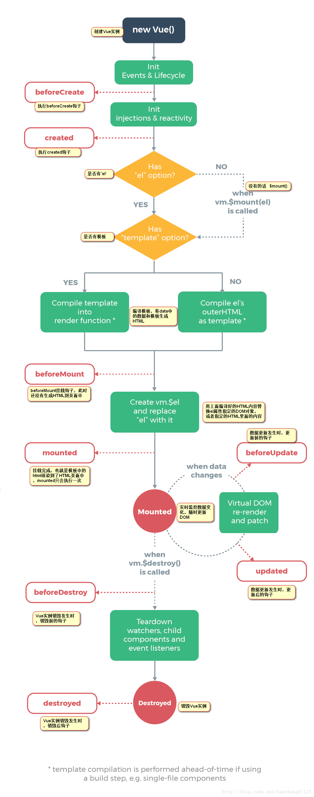
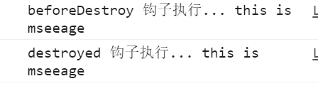

## 一. Vue生命周期

### 1.1. 简介

Vue实例从创建到销毁的过程，就是生命周期。详细来说也就是从开始创建、初始化数据、编译模板、挂载Dom、渲染→更新→渲染、卸载等一系列过程。
首先我们来看一下生命周期图：



```
beforeCreate(创建前)，在数据观测和初始化事件还未开始
created(创建后)，完成数据观测，属性和方法的运算，初始化事件，$el属性还没有显示出来
beforeMount(载入前)，在挂载开始之前被调用，相关的render函数首次被调用。实例已完成以下的配置：编译模板，把data里面的数据和模板生成html。注意此时还没有挂载html到页面上。
mounted（载入后），在el 被新创建的 vm.$el 替换，并挂载到实例上去之后调用。实例已完成以下的配置：用上面编译好的html内容替换el属性指向的DOM对象。完成模板中的html渲染到html页面中。此过程中进行ajax交互。
beforeUpdate（更新前），在数据更新之前调用，发生在虚拟DOM重新渲染和打补丁之前。可以在该钩子中进一步地更改状态，不会触发附加的重渲染过程。
updated（更新后），在由于数据更改导致的虚拟DOM重新渲染和打补丁之后调用。调用时，组件DOM已经更新，所以可以执行依赖于DOM的操作。然而在大多数情况下，应该避免在此期间更改状态，因为这可能会导致更新无限循环。该钩子在服务器端渲染期间不被调用。
beforeDestroy（销毁前），在实例销毁之前调用。实例仍然完全可用。
destroyed（销毁后），在实例销毁之后调用。调用后，所有的事件监听器会被移除，所有的子实例也会被销毁。该钩子在服务器端渲染期间不被调用。
```

第一次页面加载会触发beforeCreate、created、beforeMount、mounted, mounted说明dom渲染完毕。


### 1.2. 钩子详解

#### 1.2.1. beforeCreate

在实例初始化之后，数据观测(data observer) 和 event/watcher 事件配置之前被调用。

**html部分：**

```html
<!-- lifeCycleDemo.vue -->
<template>
	<div id="app">
		<input type="text" name="" v-model="message">
		<div>{{message}}</div>
		<ul>
			<li v-for="(item,index) of list" :key="index">{{item}}--{{message}}</li>
		</ul>
		<p>p1</p>
		<p>p1</p>
		<p>p1</p>
		<button @click="fnDestroy()">销毁</button>
	</div>
</template>
```

**JS部分：**

```js
export default {
		name: 'LifeCycleDemo',
		data() {
			return {
				message: 'this is mseeage',
				list: ['aaaaaaaa', 'bbbbbbb', 'ccccccc']
			}
		},
		//时刻监测数据message的变化,一但那变化就会吊该函数
		watch: {
			//message必须和监测的data名字一样
			message: function() {
				console.log('watch:', 'message 变了')
			}
		},
		methods: {
			init() {
				console.log('这是初始化方法')
			}
		},
		//我们在beforeCreate钩子中调用Vue的data和method
		beforeCreate() {
			console.log("beforeCreate", this.message);
			this.init();
		},
	}
```

我们在上面的例子中在的beforeCreate钩子中调用Vue的data和method，来看一下结果：


可以看到Vue中的data和方法都是去不到的，并且是在wath之前执行

#### 1.2.2. created

实例已经创建完成之后被调用。在这一步，实例已完成以下的配置：数据观测(data observer)，属性和方法的运算， watch/event 事件回调。然而，挂载阶段还没开始，$el 属性目前不可见。
主要应用：调用数据，调用方法，调用异步函数

```js
//created钩子
created() {
	//调用Vue的data
	console.log("created : ", this.message);
	//调用Vue方法
	this.foo();
	//因为我们是通过v-for循环遍历li，所以created之前挂载阶段还没开始.是无法获取li的个数的
	console.log('li数量：', document.getElementsByTagName('li').length);
	//直接加载出来的DOM是可以直接获取到的
	console.log('p个数：', document.getElementsByTagName('p').length);
}
```

结果：


可以看到：created钩子可以获取Vue的data，调用Vue方法，但是无法获取到通过挂载模板生成的DOM（例如：v-for循环遍历Vue.list生成li）

#### 1.2.3. beforeMount

在挂载开始之前被调用：相关的 render 函数（模板）首次被调用。
例如通过v-for生成的html还没有被挂载到页面上
（接 2created的代码）

```js
 beforeMount() {
     console.log('beforeMount:',document.getElementsByTagName('li').length);
  },
```

结果 beforeMount: 1

#### 1.2.4. mounted

el 被新创建的 vm.$el 替换，并挂载到实例上去之后调用该钩子。
有初始值的DOM渲染，例如我们的初始数据list,渲染出来的li，只有这里才能获取
（接 2created的代码）

```js
mounted() {
    console.log('mounted:',document.getElementsByTagName('li').length);
}
```

结果 mounted: 3
可以看到到这里为止，挂载到实例上了，我们可以获取到li的个数了

#### 1.2.5. beforeUpdate

数据更新时调用，发生在虚拟 DOM 重新渲染和打补丁之前。 你可以在这个钩子中进一步地更改状态，这不会触发附加的重渲染过程。
当我们更改Vue的任何数据，都会触发该函数

```js
beforeUpdate() {
       console.log('beforeUpdate 钩子执行...');
       console.log('beforeUpdate:'+this.message)
 }
```

#### 1.2.6. updated

由于数据更改导致的虚拟 DOM 重新渲染和打补丁，在这之后会调用该钩子。
当这个钩子被调用时，组件 DOM 已经更新，所以你现在可以执行依赖于 DOM 的操作。然而在大多数情况下，你应该避免在此期间更改状态，因为这可能会导致更新无限循环。
该钩子在服务器端渲染期间不被调用。

数据更新就会触发（vue所有的数据只有有更新就会触发）,如果想数据一遍就做统一的处理，可以用这个，如果想对不同数据的更新做不同的处理可以用nextTick，或者是watch进行监听

```js
 updated() {
     console.log('updated 钩子执行...');
     console.log('updated:',this.message)
}
```

#### 1.2.7. beforeDestroy

实例销毁之前调用。在这一步，实例仍然完全可用。

```js
beforeDestroy() {
	console.log('beforeDestroy 钩子执行...', this.message)
}
```


#### 1.2.8. destroyed

Vue 实例销毁后调用。调用后，Vue 实例指示的所有东西都会解绑定，所有的事件监听器会被移除，所有的子实例也会被销毁。 该钩子在服务器端渲染期间不被调用。

```js
destroyed() {
	console.log('destroyed 钩子执行...', this.message)
}
```

结果：



可以看打到销毁Vue实例时会调用这两个函数

#### 1.2.9、补充$mount

当你vue没有挂在el时，我们可以用$mount

```js
var app = new Vue({
    data:{
            message:'this is mseeage',
        },
}).$mount('#app')
```

### 1.3. 钩子的一些实战用法

#### 1.3.1. 异步函数

这里我们用定时器来做异步函数

```html
<!-- AsyncFunction1.vue -->
<template>
	<div id="app">
		<ul>
			<li v-for="(item,index) of list" :key="index">{{item}}</li>
		</ul>
	</div>
</template>

<script>
	export default {
		name: 'AsyncFunction1',
		data() {
			return {
				list: ['aaaaaaaa', 'bbbbbbb', 'ccccccc']
			}
		},
		//时刻监测数据message的变化,一但那变化就会吊该函数
		watch: {
			//message必须和监测的data名字一样
			message: function() {
				console.log('watch:', 'message 变了')
			}
		},
		created: function() {
			console.log('created异步：aaaaa');
			//异步获取数据
			// 因为是异步,就和我们ajax获取数据一样
			setTimeout(() => {
				this.list = ['111', '222', '333', '444'],
					console.log('created异步：', document.getElementsByTagName('li').length);
			}, 0)
		},
		mounted: function() {
			console.log('mounted:', document.getElementsByTagName('li').length);
		},
		updated: function() {
			console.log('updated:', document.getElementsByTagName('li').length)
		}
	}
</script>

```

结果为：

**解释：**
可以看到因为是在created的钩子中加入异步函数，所以函数的执行顺序为：
created钩子,mounted钩子,异步函数,updated钩子(根据事件队列原理,只有在updated后，li才是真的DOM渲染为4个，所以异步函数中获取的li的个数时是没有变化的li的个数)。
因为mounted获取到的是我们在Vue的data中设置初始值渲染的DOM，而我们是在异步函数中变化的list数据，所以mounted获取的li的个数为3。
update函数是只要数据vue绑定的数据变化就会触发，所以最后执行

这是不是意味着可以直接在update函数中操作呢，其实不是，因为update函数是针对vue的所有数据的变化，而我们也有可能会有其他数据的变化。

例如下面的例子：

```html
<!-- AsyncFunction2.vue -->
<template>
	<div id="app">
		<ul>
			<li v-for="(item,index) of list" :key="index">{{item}}</li>
		</ul>
	</div>
</template>
<script>
	export default {
		name: 'AsyncFunction2',
		data() {
			return {
				list: ['aaaaaaaa', 'bbbbbbb', 'ccccccc']
			}
		},
		//我们利用异步函数改变了两次list，会发现update被触发了2次
		created: function() {
			//异步获取数据
			// 因为是异步,就和我们ajax获取数据一样
			setTimeout(() => {
				this.list = ['111', '222', '333', '444'],
					console.log('created异步1：', document.getElementsByTagName('li').length);
			}, 0)
			setTimeout(() => {
				this.list = ['快乐大本营', '脚踏实地', '300033', '天天向上', '好好学习'],
					console.log('created异步2：', document.getElementsByTagName('li').length);
			}, 1000)
		},
		mounted: function() {
			console.log('mounted:', document.getElementsByTagName('li').length);
		},
		updated: function() {
			console.log('updated:', document.getElementsByTagName('li').length)
		}
	}
</script>
```

结果为：


#### 1.3.2. Vue.nextTick对异步函数的结果进行操作

我们想要改变数据时,各自触发各自的方法

```html
<!-- AsyncFunction3.vue -->
<template>
	<div id="app">
		<ul>
			<li v-for="(item,index) of list" :key="index">{{item}}</li>
		</ul>
	</div>
</template>

<script>
	export default {
		name: 'AsyncFunction3',
		data() {
			return {
				list: ['aaaaaaaa', 'bbbbbbb', 'ccccccc']
			}
		},
		//时刻监测数据message的变化,一但那变化就会吊该函数
		watch: {
			//message必须和监测的data名字一样
			message: function() {
				console.log('watch:', 'message 变了')
			}
		},
		created: function() {
			//异步获取数据
			// 因为是异步,就和我们ajax获取数据一样
			//为了在数据变化之后等待 Vue 完成更新 DOM ，可以在数据变化之后立即使用 Vue.nextTick(callback) 。这样回调函数在 DOM 更新完成后就会调用。
			setTimeout(() => {
				this.list = ['111', '222', '333', '444'],
					console.log('created异步1：', document.getElementsByTagName('li').length);
				this.$nextTick(function() {
					console.log("created$nextTick1：", document.getElementsByTagName('li').length)
				});
			}, 0)
			setTimeout(() => {
				this.list = ['快乐大本营', '脚踏实地', '300033', '天天向上', '好好学习'],
					console.log('created异步2：', document.getElementsByTagName('li').length);
				this.$nextTick(function() {
					console.log("created$nextTick2：", document.getElementsByTagName('li').length)
				});
			}, 1000)
		},
		mounted: function() {
			console.log('mounted:', document.getElementsByTagName('li').length);
		},
		updated: function() {
			console.log('updated:', document.getElementsByTagName('li').length)
		}
	}
</script>

```

结果：


我们可以看到通过$nextTick我们可以对异步函数的结果进行各自的操作

### 1.4. 生命周期总结

**1）beforeCreate （使用频率低）**

- 在实例创建以前调用
- 没有实例化，数据访问不到
- 可以在此时加一些loading效果，在created时进行移除

**2） created （使用频率高）**

- 实例被创建完成后调用
- 能拿到数据
- 能修改数据且修改数据不会触发updated beforeUpdate钩子函数
- 可以在这个钩子函数里发请求，访问后端接口拿数据
- 判断是否存在el，是否存在template，如果二者都有，以template为主优先， 如果 没有template,会选择el模板。如果二者都没有，有$mount 也可以调用模板
- 可在该阶段进行ajax请求异步数据的获取、初始化数据

**3）beforeMount**

- 真实的dom节点挂载到页面之前
- 编译模板已经结束，虚拟dom已经存在，
- 可以访问数据，也可以更改数据
- 且修改数据不会触发updated beforeUpdate钩子函数
- 在beforeMount和mounted之间隐藏了一个render函数，千万不能写，会覆盖系统函数

**4）mounted（挂载）**

- 真实的dom节点挂载到页面以后
- this.$refs找到ref表示的节点
- 可以访问和更改数据
- 且修改数据会触发updated beforeUpdate钩子函数
- 当需要操作dom的时候执行，可以配合$.nextTick 使用进行单一事件对数据的更新后更新dom

**5）beforeUpdate**

- 修改之前调用

**6）updated**

- 修改之后调用
- beforeUpdate 、updated 可以监控data里的所有数据变化
- 不要在update beforeUpdate修改不定数据，否则会引起死循环
- 监听data里的所有的数据，非updated莫属
- 当数据更新需要做统一业务处理的时候使用

**7）beforeDestroy**

- 实例卸载以前调用，可以清理非vue资源,防止内存泄露 

**8）destroyed**

**9）activated （使用频率较低） keep-alive 缓存组件时候调用**

**10）deactivated 缓存组件卸载的时候调用**

**11）watch: 监听特定值的变化，监听路由参数的变化，用函数的形式不能监听对象的变化（与updated对立）**

**12）nextTick:针对单一事件更新数据后立即操作dom**


## 二. 组件

组件（Component）是 Vue.js 最强大的功能之一。

组件可以扩展 HTML 元素，封装可重用的代码。

组件系统让我们可以用独立可复用的小组件来构建大型应用，几乎任意类型的应用的界面都可以抽象为一个组件树：


### 2.1. 组件注册

#### 2.1.1. 全局组件

注册一个全局组件语法格式如下：

```
Vue.component(tagName, options)
```

tagName 为组件名，options 为配置选项。注册后，我们可以使用以下方式来调用组件：

```
<tagName></tagName>
```

**全局组件实例**

注册一个简单的全局组件 childDemo1，并使用它：

```html
// childDemo1.vue
<template>
	<div>我是子组件childDemo1</div>
</template>
<scrpit>
	export default {
    	name: 'childDemo1'
    }
</scrpit>
```

```js
//main.js
import Vue from 'vue'
import App from './App.vue'
import childDemo1 from './components/childDemo1.vue'
// 注册
Vue.component('childDemo1', childDemo1)
Vue.config.productionTip = false
new Vue({
  render: h => h(App)
}).$mount('#app')
```

```html
// app.vue
<template>
  <div id="app">
	<div>我是首页</div>
	<childDemo1></childDemo1>
  </div>
</template>

<script>
export default {
  name: 'App'
}
</script>
```

#### 2.1.2. 局部组件

我们也可以在实例选项中注册局部组件，这样组件只能在这个实例中使用：

**局部组件实例**

注册一个简单的局部组件 childDemo2，并使用它：

```html
// childDemo2.vue
<template>
	<div>我是子组件childDemo2</div>
</template>
<scrpit>
export default {
    name: 'childDemo2'
}
</scrpit>
```

```html
// app.vue
<template>
  <div id="app">
	<div>我是首页</div>
	<childDemo1></childDemo1>
	<child-demo2></child-demo2>
  </div>
</template>

<script>
import childDemo2 from './components/childDemo2.vue'

export default {
  name: 'App',
  components: {
    childDemo2
  }
}
</script>
```

### 2.2. Prop

prop 是子组件用来接受父组件传递过来的数据的一个自定义属性。

父组件的数据需要通过 props 把数据传给子组件，子组件需要显式地用 props 选项声明 "prop"：

**Prop 实例**

```html
// childDemo3.vue
<template>
	<div>{{ message }}</div>
</template>
 
<script>
    export default {
		name: 'childDemo3',
		props: ['message']
	}
</script>

```

```html
// app.vue
<template>
	<span>我是父组件parentDemo3</span>
	<child-demo3 message="hello Vue!"></child-demo3>
</template>

<script>
	import childDemo3 from './childDemo3.vue'
	export default {
		name: 'app',
		components: {
			childDemo3
		}
	}
</script>
```

**Prop 验证**

组件可以为 props 指定验证要求。

为了定制 prop 的验证方式，你可以为 props 中的值提供一个带有验证需求的对象，而不是一个字符串数组。例如：

```html
// childDemo4.vue
<template>
	<div> msg: {{ message }}</div>
	<div> pname: {{ pname }}</div>
	<div> totalCount: {{ totalCount }}</div>
	<div> sex: {{ sex }}</div>
</template>
 
<script>
    export default {
		name: 'childDemo3',
		props: {
			message: String,
			num: [String, Number],
			pname: {
				type: String,
				required: true
			},
			totalCount: {
				type: Number,
				default: 0
			},
			sex: {
				validator: function(value) {
					return ['男', '女', '无'].indexOf(value) !== -1
				}
			}
		}
	}
</script>
```

当 prop 验证失败的时候，(开发环境构建版本的) Vue 将会产生一个控制台的警告。

type 可以是下面原生构造器：

- `String`
- `Number`
- `Boolean`
- `Array`
- `Object`
- `Date`
- `Function`
- `Symbol`

type 也可以是一个自定义构造器，使用 instanceof 检测。

### 2.3. 插槽

#### 2.3.1. 插槽内容

Vue 实现了一套内容分发的 API，这套 API 基于当前的 Web Components 规范草案，将 `<slot>` 元素作为承载分发内容的出口。

它允许你像这样合成组件：

```html
// app.vue
<template>
  <div id="app">
	<div>我是首页</div>
	<slot-demo1>
		<div style="border: 1px red solid; width: 200px; height: 50px;">
			这里展示的是插槽的内容
		</div>
	</slot-demo1>
  </div>
</template>

<script>
import slotDemo1 from './components/slotDemo1.vue'

export default {
  name: 'App',
  components: {
	slotDemo1
  }
}
</script>
```

然后你在子组件中可能会写为：

```html
// slotDemo1.vue
<template>
	<div>
		<div>我是第一个插槽示例组件，以下红色框内为插槽的内容</div>
		<slot></slot>
	</div>
</template>
 
<script>
export default {
	name: 'slotDemo1'
}
</script>
```

当组件渲染的时候，这个 `<slot>` 元素将会被替换为app.vue中组件内部的内容。

插槽内可以包含任何模板代码，包括 HTML，甚至其它的组件。

如果 `<slot-demo1>` 没有包含一个 `<slot>` 元素，则任何传入它的内容都会被抛弃。

#### 2.3.2. 具名插槽

有些时候我们需要多个插槽。例如，一个假设的 `<base-layout>` 组件多模板如下：

```html
<div class="container">
 <header>
  <!-- 我们希望把页头放这里 -->
 </header>
 <main>
  <!-- 我们希望把主要内容放这里 -->
 </main>
 <footer>
  <!-- 我们希望把页脚放这里 -->
 </footer>
</div>
```

对于这样的情况，`<slot>` 元素有一个特殊的特性：name。这个特性可以用来定义额外的插槽：

```html
// slotDemo2.vue
<template>
	<div class="container">
		<header>
			<slot name="header"></slot>
		</header>
		<main>
			<slot></slot>
		</main>
		<footer>
			<slot name="footer"></slot>
		</footer>
	</div>
</template>
 
<script>
export default {
	name: 'slotDemo2'
}
</script>
```

在向具名插槽提供内容的时候，我们可以在一个父组件的 `<template>` 元素上使用 slot 特性，也可以在普通元素上甚至是自定义组件上使用slot特性：

```html
// app.vue
<template>
  <div id="app">
	<div>我是首页</div>
	<slot-demo2>
		<template slot="header">
			<div>我是页面自定义的头部</div>
		</template>
		<h1>我是页面自定义的内容</h1>
		<slot-demo1 slot="footer"></slot-demo1>
	</slot-demo2>
  </div>
</template>

<script>
import slotDemo1 from './components/slotDemo1.vue'
import slotDemo2 from './components/slotDemo2.vue'

export default {
  name: 'App',
  components: {
	slotDemo1,
	slotDemo2
  }
}
</script>
```

#### 2.3.3. 默认插槽的内容

有的时候为插槽提供默认的内容是很有用的。例如，一个 `<submit-button>` 组件可能希望这个按钮的默认内容是“Submit”，但是同时允许用户覆写为“Save”、“Upload”或别的内容。

你可以在 `<slot>` 标签内部指定默认的内容来做到这一点。

```html
// slotDemo3.vue
<template>
	<div>
		<div>我是第一个插槽示例组件，以下红色框内为插槽的内容</div>
		<slot>我是插槽默认的内容</slot>
	</div>
</template>
 
<script>
export default {
	name: 'slotDemo3'
}
</script>
```

如果父组件为这个插槽提供了内容，则默认的内容会被替换掉。

#### 2.3.4. 编译作用域

当你想在插槽内使用数据时，例如：

```html
<slot-demo4 url="profile">
 Logged in as {{ user.name }}
</slot-demo4>
```

该插槽可以访问跟这个模板的其它地方相同的实例属性 (也就是说“作用域”是相同的)。但这个插槽不能访问 `<slot-demo4>` 的作用域。例如尝试访问 url 是不会工作的。牢记一条准则：

> 父组件模板的所有东西都会在父级作用域内编译；子组件模板的所有东西都会在子级作用域内编译。

#### 2.3.5. 作用域插槽

> 2.1.0+ 新增

有的时候你希望提供的组件带有一个可从子组件获取数据的可复用的插槽。例如一个简单的 `<todo-list>` 组件的模板可能包含了如下代码：

```html
<template>
	<div>
		<ul>
			<li v-for="todo in todos" v-bind:key="todo.id">
				{{ todo.text }}
			</li>
		</ul>
	</div>
</template>
```

但是在我们应用的某些部分，我们希望每个独立的待办项渲染出和 todo.text 不太一样的东西。这也是作用域插槽的用武之地。

为了让这个特性成为可能，你需要做的全部事情就是将待办项内容包裹在一个 `<slot>` 元素上，然后将所有和其上下文相关的数据传递给这个插槽：在这个例子中，这个数据是 todo 对象：

```html
// slotDemo4.vue
<template>
	<div>
		<ul>
			<li v-for="todo in todos" v-bind:key="todo.id">
				<!-- 我们为每个 todo 准备了一个插槽，-->
				<!-- 将 `todo` 对象作为一个插槽的 prop 传入。-->
				<slot v-bind:todo="todo">
					<!-- 回退的内容 -->
					{{ todo.text }}
				</slot>
			</li>
		</ul>
	</div>
</template>

<script>
	export default {
		name: 'slotDemo4',
		data() {
			return {
				todos: [
					{id: 1, text: '篮球'},
					{id: 2, text: '足球'},
					{id: 3, text: '排球'},
					{id: 4, text: '乒乓球'}
				]
			}
		}
	}
</script>

```

现在当我们使用 `<slot-demo4>` 组件的时候，我们可以选择为待办项定义一个不一样的`<template>` 作为替代方案，并且可以通过 slot-scope 特性从子组件获取数据：

```html
<template>
  <div id="app">
	<slot-demo4>
		<template slot-scope="slotProps">
			<template v-if="slotProps.todo.id%2 == 0">
				<span style="color: red;">{{slotProps.todo.text}}</span>
			</template>
			<template v-else>
				<span style="color: green;">{{slotProps.todo.text}}</span>
			</template>
		</template>
	</slot-demo4>
  </div>
</template>

<script>
import slotDemo4 from './components/slotDemo4.vue'
export default {
  name: 'App',
  components: {
	slotDemo4
  }
}
</script>
```

在 2.5.0+，slot-scope 不再限制在 `<template>` 元素上使用，而可以用在插槽内的任何元素或组件上。

**解构 slot-scope**

如果一个 JavaScript 表达式在一个函数定义的参数位置有效，那么这个表达式实际上就可以被 slot-scope 接受。也就是说你可以在支持的环境下，在这些表达式中使用解构语法。例如：

```html
<slot-demo4>
		<template slot-scope="{todo}">
			<template v-if="todo.id%2 == 0">
				<span style="color: red;">{{todo.text}}</span>
			</template>
			<template v-else>
				<span style="color: green;">{{todo.text}}</span>
			</template>
		</template>
	</slot-demo4>
```

这会使作用域插槽变得更干净一些。


## 三. 路由

本章节我们将为大家介绍 Vue.js 路由。

Vue.js 路由允许我们通过不同的 URL 访问不同的内容。

通过 Vue.js 可以实现多视图的单页Web应用（single page web application，SPA）。

Vue.js 路由需要载入 vue-router 库

------

### 3.1. 安装

**NPM：**

```
npm install vue-router
```

**简单实例**

Vue.js + vue-router 可以很简单的实现单页应用。

**`<router-link>`** 是一个组件，该组件用于设置一个导航链接，切换不同 HTML 内容。 **to** 属性为目标地址， 即要显示的内容。

以下实例中我们将 vue-router 加进来，然后配置组件和路由映射，再告诉 vue-router 在哪里渲染它们。代码如下所示：

1）在src目录下建立router目录，并添加index.js：

```js
import Vue from 'vue'
import VueRouter from 'vue-router'
import Home from '../views/Home.vue'

Vue.use(VueRouter)

const routes = [
  {
    path: '/',
    name: 'Home',
    component: Home
  },
  {
    path: '/about',
    name: 'About',
    // route level code-splitting
    // this generates a separate chunk (about.[hash].js) for this route
    // which is lazy-loaded when the route is visited.
    component: () => import(/* webpackChunkName: "about" */ '../views/About.vue')
  }
]

const router = new VueRouter({
  mode: 'history',
  base: process.env.BASE_URL,
  routes
})

export default router
```

2）在views目录下建立Home.vue和About.vue：

```html
<!-- Home.vue -->
<template>
  <div>
    <h1>
       我是首页 
      </h1>
  </div>
</template>

<script>
export default {
  name: 'home'
}
</script>
```

```html
<!-- About.vue -->
<template>
  <div>
    <h1>
       关于我们
      </h1>
  </div>
</template>

<script>
export default {
  name: 'about'
}
</script>
```

3）在main.js中引入router配置：

```js
import Vue from 'vue'
import App from './App.vue'
import router from './router'

Vue.config.productionTip = false
new Vue({
  router,
  render: h => h(App)
}).$mount('#app')
```

4）在App.vue中添加如下代码：

```js
<template>
  <div>
    <div id="nav">
      <!-- 跳转路由的链接 -->
      <router-link to="/home">Home</router-link>
	  <router-link to="/about">About</router-link>
    </div>
	<!-- 路由页面渲染的输出口 -->
    <router-view/>
  </div>
</template>
```

5）在终端输入npm run serve，就可看到实际的路由效果。

点击过的导航链接都会加上样式 **`class ="router-link-exact-active router-link-active"`**。

------

### 3.2. `<router-link>` 相关属性

接下来我们可以了解下更多关于 `<router-link>` 的属性。

#### 3.2.1. to

表示目标路由的链接。 当被点击后，内部会立刻把 to 的值传到 router.push()，所以这个值可以是一个字符串或者是描述目标位置的对象。

```html
<!-- 字符串 -->
<router-link to="home">Home</router-link>
<!-- 渲染结果 -->
<a href="home">Home</a>

<!-- 使用 v-bind 的 JS 表达式 -->
<router-link v-bind:to="'home'">Home</router-link>

<!-- 不写 v-bind 也可以，就像绑定别的属性一样 -->
<router-link :to="'home'">Home</router-link>

<!-- 同上 -->
<router-link :to="{ path: 'home' }">Home</router-link>

<!-- 命名的路由 -->
<router-link :to="{ name: 'user', params: { userId: 123 }}">User</router-link>

<!-- 带查询参数，下面的结果为 /register?plan=private -->
<router-link :to="{ path: 'register', query: { plan: 'private' }}">Register</router-link>
```

#### 3.2.2. replace

设置 replace 属性的话，当点击时，会调用 router.replace() 而不是 router.push()，导航后不会留下 history 记录。

```html
<router-link :to="{ path: '/abc'}" replace></router-link>
```

#### 3.2.3. append

设置 append 属性后，则在当前 (相对) 路径前添加其路径。例如，我们从 /a 导航到一个相对路径 b，如果没有配置 append，则路径为 /b，如果配了，则为 /a/b

```html
<router-link :to="{ path: 'relative/path'}" append></router-link>
```

#### 3.2.4. tag

有时候想要 `<router-link>` 渲染成某种标签，例如 `<li>`。 于是我们使用 `tag` prop 类指定何种标签，同样它还是会监听点击，触发导航。

```html
<router-link to="/foo" tag="li">foo</router-link>
<!-- 渲染结果 -->
<li>foo</li>
```

#### 3.2.5. active-class

设置 链接激活时使用的 CSS 类名。可以通过以下代码来替代。

```html
<style>
   ._active{
      background-color : red;
   }
</style>
<p>
   <router-link v-bind:to = "{ path: '/route1'}" active-class = "_active">Router Link 1</router-link>
   <router-link v-bind:to = "{ path: '/route2'}" tag = "span">Router Link 2</router-link>
</p>
```

注意这里 **class** 使用 **active-class="_active"**。

#### 3.2.6. exact-active-class

配置当链接被精确匹配的时候应该激活的 class。可以通过以下代码来替代。

```html
<p>
   <router-link v-bind:to = "{ path: '/route1'}" exact-active-class = "_active">Router Link 1</router-link>
   <router-link v-bind:to = "{ path: '/route2'}" tag = "span">Router Link 2</router-link>
</p>
```

#### 3.2.7. event

声明可以用来触发导航的事件。可以是一个字符串或是一个包含字符串的数组。

```html
<router-link v-bind:to = "{ path: '/route1'}" event = "mouseover">Router Link 1</router-link>
```

以上代码设置了 event 为 mouseover ，及在鼠标移动到 Router Link 1 上时导航的 HTML 内容会发生改变。

通过注入路由器，我们可以在任何组件内通过 `this.$router` 访问路由器，也可以通过 `this.$route` 访问当前路由：

```js
// Home.vue
export default {
  computed: {
    username() {
      // 我们很快就会看到 `params` 是什么
      return this.$route.params.username
    }
  },
  methods: {
    goBack() {
      window.history.length > 1 ? this.$router.go(-1) : this.$router.push('/')
    }
  }
}
```

该文档通篇都常使用 `router` 实例。留意一下 `this.$router` 和 `router` 使用起来完全一样。我们使用 `this.$router` 的原因是我们并不想在每个独立需要封装路由的组件中都导入路由。

### 3.3. 动态路由匹配

我们经常需要把某种模式匹配到的所有路由，全都映射到同个组件。例如，我们有一个 `User` 组件，对于所有 ID 各不相同的用户，都要使用这个组件来渲染。那么，我们可以在 `vue-router` 的路由路径中使用“动态路径参数”(dynamic segment) 来达到这个效果：

```js
const User = {
  template: '<div>User</div>'
}

const router = new VueRouter({
  routes: [
    // 动态路径参数 以冒号开头
    { path: '/user/:id', component: User }
  ]
})
```

现在呢，像 `/user/foo` 和 `/user/bar` 都将映射到相同的路由。

一个“路径参数”使用冒号 `:` 标记。当匹配到一个路由时，参数值会被设置到 `this.$route.params`，可以在每个组件内使用。于是，我们可以更新 `User` 的模板，输出当前用户的 ID：

```js
const User = {
  template: '<div>User {{ $route.params.id }}</div>'
}
```

你可以在一个路由中设置多段“路径参数”，对应的值都会设置到 `$route.params` 中。例如：

| 模式                          | 匹配路径            | $route.params                          |
| ----------------------------- | ------------------- | -------------------------------------- |
| /user/:username               | /user/evan          | `{ username: 'evan' }`                 |
| /user/:username/post/:post_id | /user/evan/post/123 | `{ username: 'evan', post_id: '123' }` |

除了 `$route.params` 外，`$route` 对象还提供了其它有用的信息，例如，`$route.query` (如果 URL 中有查询参数)、`$route.hash` 等等。你可以查看 [API 文档](https://router.vuejs.org/zh/api/#路由对象) 的详细说明。

**响应路由参数的变化**

提醒一下，当使用路由参数时，例如从 `/user/foo` 导航到 `/user/bar`，原来的组件实例会被复用。因为两个路由都渲染同个组件，比起销毁再创建，复用则显得更加高效。不过，这也意味着组件的生命周期钩子不会再被调用。

复用组件时，想对路由参数的变化作出响应的话，你可以简单地 watch (监测变化) `$route` 对象：

```js
const User = {
  template: '...',
  watch: {
    $route(to, from) {
      // 对路由变化作出响应...
    }
  }
}
```

或者使用后续会使用到的 `beforeRouteUpdate` 导航守卫：

```js
const User = {
  template: '...',
  beforeRouteUpdate(to, from, next) {
    // react to route changes...
    // don't forget to call next()
  }
}
```

**捕获所有路由或 404 Not found 路由**

常规参数只会匹配被 `/` 分隔的 URL 片段中的字符。如果想匹配**任意路径**，我们可以使用通配符 (`*`)：

```js
{
  // 会匹配所有路径
  path: '*'
}
{
  // 会匹配以 `/user-` 开头的任意路径
  path: '/user-*'
}
```

当使用*通配符*路由时，请确保路由的顺序是正确的，也就是说含有*通配符*的路由应该放在最后。路由 `{ path: '*' }` 通常用于客户端 404 错误。

当使用一个*通配符*时，`$route.params` 内会自动添加一个名为 `pathMatch` 参数。它包含了 URL 通过*通配符*被匹配的部分：

```js
// 给出一个路由 { path: '/user-*' }
this.$router.push('/user-admin')
this.$route.params.pathMatch // 'admin'
// 给出一个路由 { path: '*' }
this.$router.push('/non-existing')
this.$route.params.pathMatch // '/non-existing'
```

**高级匹配模式**

`vue-router` 使用 [path-to-regexp](https://github.com/pillarjs/path-to-regexp/tree/v1.7.0) 作为路径匹配引擎，所以支持很多高级的匹配模式，例如：可选的动态路径参数、匹配零个或多个、一个或多个，甚至是自定义正则匹配。查看它的[文档](https://github.com/pillarjs/path-to-regexp/tree/v1.7.0#parameters)学习高阶的路径匹配，还有[这个例子 ](https://github.com/vuejs/vue-router/blob/dev/examples/route-matching/app.js)展示 `vue-router` 怎么使用这类匹配。

**匹配优先级**

有时候，同一个路径可以匹配多个路由，此时，匹配的优先级就按照路由的定义顺序：谁先定义的，谁的优先级就最高。

### 3.4. 嵌套路由

实际生活中的应用界面，通常由多层嵌套的组件组合而成。同样地，URL 中各段动态路径也按某种结构对应嵌套的各层组件，例如：

```text
/user/foo/profile                     /user/foo/posts
+------------------+                  +-----------------+
| User             |                  | User            |
| +--------------+ |                  | +-------------+ |
| | Profile      | |  +------------>  | | Posts       | |
| |              | |                  | |             | |
| +--------------+ |                  | +-------------+ |
+------------------+                  +-----------------+
```

借助 `vue-router`，使用嵌套路由配置，就可以很简单地表达这种关系。

接着上节创建的 app：

```html
<div id="app">
  <router-view></router-view>
</div>
const User = {
  template: '<div>User {{ $route.params.id }}</div>'
}

const router = new VueRouter({
  routes: [{ path: '/user/:id', component: User }]
})
```

这里的 `<router-view>` 是最顶层的出口，渲染最高级路由匹配到的组件。同样地，一个被渲染组件同样可以包含自己的嵌套 `<router-view>`。例如，在 `User` 组件的模板添加一个 `<router-view>`：

```js
const User = {
  template: `
    <div class="user">
      <h2>User {{ $route.params.id }}</h2>
      <router-view></router-view>
    </div>
  `
}
```

要在嵌套的出口中渲染组件，需要在 `VueRouter` 的参数中使用 `children` 配置：

```js
const router = new VueRouter({
  routes: [
    {
      path: '/user/:id',
      component: User,
      children: [
        {
          // 当 /user/:id/profile 匹配成功，
          // UserProfile 会被渲染在 User 的 <router-view> 中
          path: 'profile',
          component: UserProfile
        },
        {
          // 当 /user/:id/posts 匹配成功
          // UserPosts 会被渲染在 User 的 <router-view> 中
          path: 'posts',
          component: UserPosts
        }
      ]
    }
  ]
})
```

**要注意，以 `/` 开头的嵌套路径会被当作根路径。 这让你充分的使用嵌套组件而无须设置嵌套的路径。**

你会发现，`children` 配置就是像 `routes` 配置一样的路由配置数组，所以呢，你可以嵌套多层路由。

此时，基于上面的配置，当你访问 `/user/foo` 时，`User` 的出口是不会渲染任何东西，这是因为没有匹配到合适的子路由。如果你想要渲染点什么，可以提供一个 空的 子路由：

```js
const router = new VueRouter({
  routes: [
    {
      path: '/user/:id',
      component: User,
      children: [
        // 当 /user/:id 匹配成功，
        // UserHome 会被渲染在 User 的 <router-view> 中
        { path: '', component: UserHome }

        // ...其他子路由
      ]
    }
  ]
})
```

### 3.5. 编程式的导航

除了使用 `<router-link>` 创建 a 标签来定义导航链接，我们还可以借助 router 的实例方法，通过编写代码来实现。

**`router.push(location, onComplete?, onAbort?)`**

注意：在 Vue 实例内部，你可以通过 `$router` 访问路由实例。因此你可以调用 `this.$router.push`。

想要导航到不同的 URL，则使用 `router.push` 方法。这个方法会向 history 栈添加一个新的记录，所以，当用户点击浏览器后退按钮时，则回到之前的 URL。

当你点击 `<router-link>` 时，这个方法会在内部调用，所以说，点击 `<router-link :to="...">` 等同于调用 `router.push(...)`。

| 声明式                    | 编程式             |
| ------------------------- | ------------------ |
| `<router-link :to="...">` | `router.push(...)` |

该方法的参数可以是一个字符串路径，或者一个描述地址的对象。例如：

```js
// 字符串
router.push('home')

// 对象
router.push({ path: 'home' })

// 命名的路由
router.push({ name: 'user', params: { userId: '123' }})

// 带查询参数，变成 /register?plan=private
router.push({ path: 'register', query: { plan: 'private' }})
```

注意：如果提供了 `path`，`params` 会被忽略，上述例子中的 `query` 并不属于这种情况。取而代之的是下面例子的做法，你需要提供路由的 `name` 或手写完整的带有参数的 `path`：

```js
const userId = '123'
router.push({ name: 'user', params: { userId }}) // -> /user/123
router.push({ path: `/user/${userId}` }) // -> /user/123
// 这里的 params 不生效
router.push({ path: '/user', params: { userId }}) // -> /user
```

同样的规则也适用于 `router-link` 组件的 `to` 属性。

在 2.2.0+，可选的在 `router.push` 或 `router.replace` 中提供 `onComplete` 和 `onAbort` 回调作为第二个和第三个参数。这些回调将会在导航成功完成 (在所有的异步钩子被解析之后) 或终止 (导航到相同的路由、或在当前导航完成之前导航到另一个不同的路由) 的时候进行相应的调用。在 3.1.0+，可以省略第二个和第三个参数，此时如果支持 Promise，`router.push` 或 `router.replace` 将返回一个 Promise。

注意： 如果目的地和当前路由相同，只有参数发生了改变 (比如从一个用户资料到另一个 `/users/1` -> `/users/2`)，你需要使用 [`beforeRouteUpdate`](https://router.vuejs.org/zh/guide/essentials/dynamic-matching.html#响应路由参数的变化) 来响应这个变化 (比如抓取用户信息)。

**`router.replace(location, onComplete?, onAbort?)`**

跟 `router.push` 很像，唯一的不同就是，它不会向 history 添加新记录，而是跟它的方法名一样 —— 替换掉当前的 history 记录。

| 声明式                            | 编程式                |
| --------------------------------- | --------------------- |
| `<router-link :to="..." replace>` | `router.replace(...)` |

**`router.go(n)`**

这个方法的参数是一个整数，意思是在 history 记录中向前或者后退多少步，类似 `window.history.go(n)`。

例子

```js
// 在浏览器记录中前进一步，等同于 history.forward()
router.go(1)

// 后退一步记录，等同于 history.back()
router.go(-1)

// 前进 3 步记录
router.go(3)

// 如果 history 记录不够用，那就默默地失败呗
router.go(-100)
router.go(100)
```

**操作 History**

你也许注意到 `router.push`、 `router.replace` 和 `router.go` 跟 [`window.history.pushState`、 `window.history.replaceState` 和 `window.history.go`](https://developer.mozilla.org/en-US/docs/Web/API/History)好像， 实际上它们确实是效仿 `window.history` API 的。

因此，如果你已经熟悉 [Browser History APIs](https://developer.mozilla.org/en-US/docs/Web/API/History_API)，那么在 Vue Router 中操作 history 就是超级简单的。

还有值得提及的，Vue Router 的导航方法 (`push`、 `replace`、 `go`) 在各类路由模式 (`history`、 `hash` 和 `abstract`) 下表现一致。

### 3.6. 命名路由

有时候，通过一个名称来标识一个路由显得更方便一些，特别是在链接一个路由，或者是执行一些跳转的时候。你可以在创建 Router 实例的时候，在 `routes` 配置中给某个路由设置名称。

```js
const router = new VueRouter({
  routes: [
    {
      path: '/user/:userId',
      name: 'user',
      component: User
    }
  ]
})
```

要链接到一个命名路由，可以给 `router-link` 的 `to` 属性传一个对象：

```html
<router-link :to="{ name: 'user', params: { userId: 123 }}">User</router-link>
```

这跟代码调用 `router.push()` 是一回事：

```js
router.push({ name: 'user', params: { userId: 123 } })
```

这两种方式都会把路由导航到 `/user/123` 路径。

### 3.7. 命名视图

有时候想同时 (同级) 展示多个视图，而不是嵌套展示，例如创建一个布局，有 `sidebar` (侧导航) 和 `main` (主内容) 两个视图，这个时候命名视图就派上用场了。你可以在界面中拥有多个单独命名的视图，而不是只有一个单独的出口。如果 `router-view` 没有设置名字，那么默认为 `default`。

```html
<router-view class="view one"></router-view>
<router-view class="view two" name="a"></router-view>
<router-view class="view three" name="b"></router-view>
```

一个视图使用一个组件渲染，因此对于同个路由，多个视图就需要多个组件。确保正确使用 `components` 配置 (带上 s)：

```js
const router = new VueRouter({
  routes: [
    {
      path: '/',
      components: {
        default: Foo,
        a: Bar,
        b: Baz
      }
    }
  ]
})
```

**嵌套命名视图**

我们也有可能使用命名视图创建嵌套视图的复杂布局。这时你也需要命名用到的嵌套 `router-view` 组件。我们以一个设置面板为例：

```text
/settings/emails                                       /settings/profile
+-----------------------------------+                  +------------------------------+
| UserSettings                      |                  | UserSettings                 |
| +-----+-------------------------+ |                  | +-----+--------------------+ |
| | Nav | UserEmailsSubscriptions | |  +------------>  | | Nav | UserProfile        | |
| |     +-------------------------+ |                  | |     +--------------------+ |
| |     |                         | |                  | |     | UserProfilePreview | |
| +-----+-------------------------+ |                  | +-----+--------------------+ |
+-----------------------------------+                  +------------------------------+
```

- `Nav` 只是一个常规组件。
- `UserSettings` 是一个视图组件。
- `UserEmailsSubscriptions`、`UserProfile`、`UserProfilePreview` 是嵌套的视图组件。

注意：*我们先忘记 HTML/CSS 具体的布局的样子，只专注在用到的组件上。*

`UserSettings` 组件的 `<template>` 部分应该是类似下面的这段代码：

```html
<!-- UserSettings.vue -->
<div>
  <h1>User Settings</h1>
  <NavBar/>
  <router-view/>
  <router-view name="helper"/>
</div>
```

*嵌套的视图组件在此已经被忽略了，但是你可以在[这里](https://jsfiddle.net/posva/22wgksa3/)找到完整的源代码。*

然后你可以用这个路由配置完成该布局：

```js
{
  path: '/settings',
  // 你也可以在顶级路由就配置命名视图
  component: UserSettings,
  children: [{
    path: 'emails',
    component: UserEmailsSubscriptions
  }, {
    path: 'profile',
    components: {
      default: UserProfile,
      helper: UserProfilePreview
    }
  }]
}
```

### 3.8. 重定向和别名

**重定向**

重定向也是通过 `routes` 配置来完成，下面例子是从 `/a` 重定向到 `/b`：

```js
const router = new VueRouter({
  routes: [
    { path: '/a', redirect: '/b' }
  ]
})
```

重定向的目标也可以是一个命名的路由：

```js
const router = new VueRouter({
  routes: [
    { path: '/a', redirect: { name: 'foo' }}
  ]
})
```

甚至是一个方法，动态返回重定向目标：

```js
const router = new VueRouter({
  routes: [
    { path: '/a', redirect: to => {
      // 方法接收 目标路由 作为参数
      // return 重定向的 字符串路径/路径对象
    }}
  ]
})
```

注意[导航守卫](https://router.vuejs.org/zh/guide/advanced/navigation-guards.html)并没有应用在跳转路由上，而仅仅应用在其目标上。在下面这个例子中，为 `/a` 路由添加一个 `beforeEnter` 守卫并不会有任何效果。

其它高级用法，请参考[例子](https://github.com/vuejs/vue-router/blob/dev/examples/redirect/app.js)。

**别名**

“重定向”的意思是，当用户访问 `/a`时，URL 将会被替换成 `/b`，然后匹配路由为 `/b`，那么“别名”又是什么呢？

`/a` 的别名是 `/b`，意味着，当用户访问 `/b` 时，URL 会保持为 `/b`，但是路由匹配则为 `/a`，就像用户访问 `/a` 一样。

上面对应的路由配置为：

```js
const router = new VueRouter({
  routes: [
    { path: '/a', component: A, alias: '/b' }
  ]
})
```

“别名”的功能让你可以自由地将 UI 结构映射到任意的 URL，而不是受限于配置的嵌套路由结构。

### 3.9. 路由组件传参

在组件中使用 `$route` 会使之与其对应路由形成高度耦合，从而使组件只能在某些特定的 URL 上使用，限制了其灵活性。

使用 `props` 将组件和路由解耦：

**取代与 `$route` 的耦合**

```js
const User = {
  template: '<div>User {{ $route.params.id }}</div>'
}
const router = new VueRouter({
  routes: [{ path: '/user/:id', component: User }]
})
```

**通过 `props` 解耦**

```js
const User = {
  props: ['id'],
  template: '<div>User {{ id }}</div>'
}
const router = new VueRouter({
  routes: [
    { path: '/user/:id', component: User, props: true },

    // 对于包含命名视图的路由，你必须分别为每个命名视图添加 `props` 选项：
    {
      path: '/user/:id',
      components: { default: User, sidebar: Sidebar },
      props: { default: true, sidebar: false }
    }
  ]
})
```

这样你便可以在任何地方使用该组件，使得该组件更易于重用和测试。

**布尔模式**

如果 `props` 被设置为 `true`，`route.params` 将会被设置为组件属性。

**对象模式**

如果 `props` 是一个对象，它会被按原样设置为组件属性。当 `props` 是静态的时候有用。

```js
const router = new VueRouter({
  routes: [
    {
      path: '/promotion/from-newsletter',
      component: Promotion,
      props: { newsletterPopup: false }
    }
  ]
})
```

**函数模式**

你可以创建一个函数返回 `props`。这样你便可以将参数转换成另一种类型，将静态值与基于路由的值结合等等。

```js
const router = new VueRouter({
  routes: [
    {
      path: '/search',
      component: SearchUser,
      props: route => ({ query: route.query.q })
    }
  ]
})
```

URL `/search?q=vue` 会将 `{query: 'vue'}` 作为属性传递给 `SearchUser` 组件。

请尽可能保持 `props` 函数为无状态的，因为它只会在路由发生变化时起作用。如果你需要状态来定义 `props`，请使用包装组件，这样 Vue 才可以对状态变化做出反应。

### 3.10. 导航守卫

正如其名，`vue-router` 提供的导航守卫主要用来通过跳转或取消的方式守卫导航。有多种机会植入路由导航过程中：全局的, 单个路由独享的, 或者组件级的。

记住**参数或查询的改变并不会触发进入/离开的导航守卫**。你可以通过[观察 `$route` 对象](https://router.vuejs.org/zh/guide/essentials/dynamic-matching.html#响应路由参数的变化)来应对这些变化，或使用 `beforeRouteUpdate` 的组件内守卫。

[观看 Vue School 的导航守卫如何工作的免费视频课程 (英文)](https://vueschool.io/lessons/how-to-configure-an-authentication-middleware-route-guard-with-vue-router?friend=vuerouter)

#### 3.10.1. 全局前置守卫

你可以使用 `router.beforeEach` 注册一个全局前置守卫：

```js
const router = new VueRouter({ ... })

router.beforeEach((to, from, next) => {
  // ...
})
```

当一个导航触发时，全局前置守卫按照创建顺序调用。守卫是异步解析执行，此时导航在所有守卫 resolve 完之前一直处于 **等待中**。

每个守卫方法接收三个参数：

- **`to: Route`**: 即将要进入的目标 [路由对象](https://router.vuejs.org/zh/api/#路由对象)
- **`from: Route`**: 当前导航正要离开的路由
- **`next: Function`**: 一定要调用该方法来 **resolve** 这个钩子。执行效果依赖 `next` 方法的调用参数。
  - **`next()`**: 进行管道中的下一个钩子。如果全部钩子执行完了，则导航的状态就是 **confirmed** (确认的)。
  - **`next(false)`**: 中断当前的导航。如果浏览器的 URL 改变了 (可能是用户手动或者浏览器后退按钮)，那么 URL 地址会重置到 `from` 路由对应的地址。
  - **`next('/')` 或者 `next({ path: '/' })`**: 跳转到一个不同的地址。当前的导航被中断，然后进行一个新的导航。你可以向 `next` 传递任意位置对象，且允许设置诸如 `replace: true`、`name: 'home'` 之类的选项以及任何用在 [`router-link` 的 `to` prop](https://router.vuejs.org/zh/api/#to) 或 [`router.push`](https://router.vuejs.org/zh/api/#router-push) 中的选项。
  - **`next(error)`**: (2.4.0+) 如果传入 `next` 的参数是一个 `Error` 实例，则导航会被终止且该错误会被传递给 [`router.onError()`](https://router.vuejs.org/zh/api/#router-onerror) 注册过的回调。

**确保 `next` 函数在任何给定的导航守卫中都被严格调用一次。它可以出现多于一次，但是只能在所有的逻辑路径都不重叠的情况下，否则钩子永远都不会被解析或报错**。这里有一个在用户未能验证身份时重定向到 `/login` 的示例：

```js
// BAD
router.beforeEach((to, from, next) => {
  if (to.name !== 'Login' && !isAuthenticated) next({ name: 'Login' })
  // 如果用户未能验证身份，则 `next` 会被调用两次
  next()
})
// GOOD
router.beforeEach((to, from, next) => {
  if (to.name !== 'Login' && !isAuthenticated) next({ name: 'Login' })
  else next()
})
```

#### 3.10.2. 全局解析守卫

> 2.5.0 新增

在 2.5.0+ 你可以用 `router.beforeResolve` 注册一个全局守卫。这和 `router.beforeEach` 类似，区别是在导航被确认之前，**同时在所有组件内守卫和异步路由组件被解析之后**，解析守卫就被调用。

#### 3.10.3. 全局后置钩子

你也可以注册全局后置钩子，然而和守卫不同的是，这些钩子不会接受 `next` 函数也不会改变导航本身：

```js
router.afterEach((to, from) => {
  // ...
})
```

#### 3.10.4. 路由独享的守卫

你可以在路由配置上直接定义 `beforeEnter` 守卫：

```js
const router = new VueRouter({
  routes: [
    {
      path: '/foo',
      component: Foo,
      beforeEnter: (to, from, next) => {
        // ...
      }
    }
  ]
})
```

这些守卫与全局前置守卫的方法参数是一样的。

#### 3.10.5. 组件内的守卫

最后，你可以在路由组件内直接定义以下路由导航守卫：

- `beforeRouteEnter`
- `beforeRouteUpdate` (2.2 新增)
- `beforeRouteLeave`

```js
const Foo = {
  template: `...`,
  beforeRouteEnter(to, from, next) {
    // 在渲染该组件的对应路由被 confirm 前调用
    // 不！能！获取组件实例 `this`
    // 因为当守卫执行前，组件实例还没被创建
  },
  beforeRouteUpdate(to, from, next) {
    // 在当前路由改变，但是该组件被复用时调用
    // 举例来说，对于一个带有动态参数的路径 /foo/:id，在 /foo/1 和 /foo/2 之间跳转的时候，
    // 由于会渲染同样的 Foo 组件，因此组件实例会被复用。而这个钩子就会在这个情况下被调用。
    // 可以访问组件实例 `this`
  },
  beforeRouteLeave(to, from, next) {
    // 导航离开该组件的对应路由时调用
    // 可以访问组件实例 `this`
  }
}
```

`beforeRouteEnter` 守卫 **不能** 访问 `this`，因为守卫在导航确认前被调用，因此即将登场的新组件还没被创建。

不过，你可以通过传一个回调给 `next`来访问组件实例。在导航被确认的时候执行回调，并且把组件实例作为回调方法的参数。

```js
beforeRouteEnter (to, from, next) {
  next(vm => {
    // 通过 `vm` 访问组件实例
  })
}
```

注意 `beforeRouteEnter` 是支持给 `next` 传递回调的唯一守卫。对于 `beforeRouteUpdate` 和 `beforeRouteLeave` 来说，`this` 已经可用了，所以**不支持**传递回调，因为没有必要了。

```js
beforeRouteUpdate (to, from, next) {
  // just use `this`
  this.name = to.params.name
  next()
}
```

这个离开守卫通常用来禁止用户在还未保存修改前突然离开。该导航可以通过 `next(false)` 来取消。

```js
beforeRouteLeave (to, from, next) {
  const answer = window.confirm('Do you really want to leave? you have unsaved changes!')
  if (answer) {
    next()
  } else {
    next(false)
  }
}
```

#### 3.10.6. **完整的导航解析流程**

1. 导航被触发。
2. 在失活的组件里调用 `beforeRouteLeave` 守卫。
3. 调用全局的 `beforeEach` 守卫。
4. 在重用的组件里调用 `beforeRouteUpdate` 守卫 (2.2+)。
5. 在路由配置里调用 `beforeEnter`。
6. 解析异步路由组件。
7. 在被激活的组件里调用 `beforeRouteEnter`。
8. 调用全局的 `beforeResolve` 守卫 (2.5+)。
9. 导航被确认。
10. 调用全局的 `afterEach` 钩子。
11. 触发 DOM 更新。
12. 调用 `beforeRouteEnter` 守卫中传给 `next` 的回调函数，创建好的组件实例会作为回调函数的参数传入。

### 3.11. 路由元信息

定义路由的时候可以配置 `meta` 字段：

```js
const router = new VueRouter({
  routes: [
    {
      path: '/foo',
      component: Foo,
      children: [
        {
          path: 'bar',
          component: Bar,
          // a meta field
          meta: { requiresAuth: true }
        }
      ]
    }
  ]
})
```

那么如何访问这个 `meta` 字段呢？

首先，我们称呼 `routes` 配置中的每个路由对象为 **路由记录**。路由记录可以是嵌套的，因此，当一个路由匹配成功后，他可能匹配多个路由记录

例如，根据上面的路由配置，`/foo/bar` 这个 URL 将会匹配父路由记录以及子路由记录。

一个路由匹配到的所有路由记录会暴露为 `$route` 对象 (还有在导航守卫中的路由对象) 的 `$route.matched` 数组。因此，我们需要遍历 `$route.matched` 来检查路由记录中的 `meta` 字段。

下面例子展示在全局导航守卫中检查元字段：

```js
router.beforeEach((to, from, next) => {
  if (to.matched.some(record => record.meta.requiresAuth)) {
    // this route requires auth, check if logged in
    // if not, redirect to login page.
    if (!auth.loggedIn()) {
      next({
        path: '/login',
        query: { redirect: to.fullPath }
      })
    } else {
      next()
    }
  } else {
    next() // 确保一定要调用 next()
  }
})
```

### 3.12. 数据获取

有时候，进入某个路由后，需要从服务器获取数据。例如，在渲染用户信息时，你需要从服务器获取用户的数据。我们可以通过两种方式来实现：

- **导航完成之后获取**：先完成导航，然后在接下来的组件生命周期钩子中获取数据。在数据获取期间显示“加载中”之类的指示。
- **导航完成之前获取**：导航完成前，在路由进入的守卫中获取数据，在数据获取成功后执行导航。

从技术角度讲，两种方式都不错 —— 就看你想要的用户体验是哪种。

#### 3.12.1. 导航完成后获取数据

当你使用这种方式时，我们会马上导航和渲染组件，然后在组件的 `created` 钩子中获取数据。这让我们有机会在数据获取期间展示一个 loading 状态，还可以在不同视图间展示不同的 loading 状态。

假设我们有一个 `Post` 组件，需要基于 `$route.params.id` 获取文章数据：

```html
<template>
  <div class="post">
    <div v-if="loading" class="loading">
      Loading...
    </div>

    <div v-if="error" class="error">
      {{ error }}
    </div>

    <div v-if="post" class="content">
      <h2>{{ post.title }}</h2>
      <p>{{ post.body }}</p>
    </div>
  </div>
</template>
export default {
  data () {
    return {
      loading: false,
      post: null,
      error: null
    }
  },
  created () {
    // 组件创建完后获取数据，
    // 此时 data 已经被 observed 了
    this.fetchData()
  },
  watch: {
    // 如果路由有变化，会再次执行该方法
    '$route': 'fetchData'
  },
  methods: {
    fetchData () {
      this.error = this.post = null
      this.loading = true
      // replace getPost with your data fetching util / API wrapper
      getPost(this.$route.params.id, (err, post) => {
        this.loading = false
        if (err) {
          this.error = err.toString()
        } else {
          this.post = post
        }
      })
    }
  }
}
```

#### 3.12.2. 在导航完成前获取数据

通过这种方式，我们在导航转入新的路由前获取数据。我们可以在接下来的组件的 `beforeRouteEnter` 守卫中获取数据，当数据获取成功后只调用 `next` 方法。

```js
export default {
  data () {
    return {
      post: null,
      error: null
    }
  },
  beforeRouteEnter (to, from, next) {
    getPost(to.params.id, (err, post) => {
      next(vm => vm.setData(err, post))
    })
  },
  // 路由改变前，组件就已经渲染完了
  // 逻辑稍稍不同
  beforeRouteUpdate (to, from, next) {
    this.post = null
    getPost(to.params.id, (err, post) => {
      this.setData(err, post)
      next()
    })
  },
  methods: {
    setData (err, post) {
      if (err) {
        this.error = err.toString()
      } else {
        this.post = post
      }
    }
  }
}
```

在为后面的视图获取数据时，用户会停留在当前的界面，因此建议在数据获取期间，显示一些进度条或者别的指示。如果数据获取失败，同样有必要展示一些全局的错误提醒。

### 3.13. 路由懒加载

当打包构建应用时，JavaScript 包会变得非常大，影响页面加载。如果我们能把不同路由对应的组件分割成不同的代码块，然后当路由被访问的时候才加载对应组件，这样就更加高效了。

结合 Vue 的[异步组件](https://cn.vuejs.org/v2/guide/components-dynamic-async.html#异步组件)和 Webpack 的[代码分割功能](https://doc.webpack-china.org/guides/code-splitting-async/#require-ensure-/)，轻松实现路由组件的懒加载。

首先，可以将异步组件定义为返回一个 Promise 的工厂函数 (该函数返回的 Promise 应该 resolve 组件本身)：

```js
const Foo = () =>
  Promise.resolve({
    /* 组件定义对象 */
  })
```

第二，在 Webpack 2 中，我们可以使用[动态 import](https://github.com/tc39/proposal-dynamic-import)语法来定义代码分块点 (split point)：

```js
import('./Foo.vue') // 返回 Promise
```

注意

如果您使用的是 Babel，你将需要添加 [`syntax-dynamic-import`](https://babeljs.io/docs/plugins/syntax-dynamic-import/) 插件，才能使 Babel 可以正确地解析语法。

结合这两者，这就是如何定义一个能够被 Webpack 自动代码分割的异步组件。

```js
const Foo = () => import('./Foo.vue')
```

在路由配置中什么都不需要改变，只需要像往常一样使用 `Foo`：

```js
const router = new VueRouter({
  routes: [{ path: '/foo', component: Foo }]
})
```

**把组件按组分块**

有时候我们想把某个路由下的所有组件都打包在同个异步块 (chunk) 中。只需要使用 [命名 chunk](https://webpack.js.org/guides/code-splitting-require/#chunkname)，一个特殊的注释语法来提供 chunk name (需要 Webpack > 2.4)。

```js
const Foo = () => import(/* webpackChunkName: "group-foo" */ './Foo.vue')
const Bar = () => import(/* webpackChunkName: "group-foo" */ './Bar.vue')
const Baz = () => import(/* webpackChunkName: "group-foo" */ './Baz.vue')
```

Webpack 会将任何一个异步模块与相同的块名称组合到相同的异步块中。

### 3.14. 导航故障

*导航故障*，或者叫*导航失败*，表示一次失败的导航，原文叫 navigation failures，本文统一采用*导航故障*。

当使用 `router-link` 组件时，Vue Router 会自动调用 `router.push` 来触发一次导航。 虽然大多数链接的预期行为是将用户导航到一个新页面，但也有少数情况下用户将留在同一页面上：

- 用户已经位于他们正在尝试导航到的页面
- 一个[导航守卫](https://router.vuejs.org/zh/guide/advanced/navigation-guards.html)通过调用 `next(false)` 中断了这次导航
- 一个[导航守卫](https://router.vuejs.org/zh/guide/advanced/navigation-guards.html)抛出了一个错误，或者调用了 `next(new Error())`

当使用 `router-link` 组件时，**这些失败都不会打印出错误**。然而，如果你使用 `router.push` 或者 `router.replace` 的话，可能会在控制台看到一条 *"Uncaught (in promise) Error"* 这样的错误，后面跟着一条更具体的消息。让我们来了解一下如何区分*导航故障*。

背景故事

在 v3.2.0 中，可以通过使用 `router.push` 的两个可选的回调函数：`onComplete` 和 `onAbort` 来暴露*导航故障*。从版本 3.1.0 开始，`router.push` 和 `router.replace` 在没有提供 `onComplete`/`onAbort` 回调的情况下会返回一个 *Promise*。这个 *Promise* 的 resolve 和 reject 将分别用来代替 `onComplete` 和 `onAbort` 的调用。

#### 3.14.1. 检测导航故障

*导航故障*是一个 `Error` 实例，附带了一些额外的属性。要检查一个错误是否来自于路由器，可以使用 `isNavigationFailure` 函数：

```js
import VueRouter from 'vue-router'
const { isNavigationFailure, NavigationFailureType } = VueRouter

// 正在尝试访问 admin 页面
router.push('/admin').catch(failure => {
  if (isNavigationFailure(failure, NavigationFailureType.redirected)) {
    // 向用户显示一个小通知
    showToast('Login in order to access the admin panel')
  }
})
```

提示

如果你忽略第二个参数：`isNavigationFailure(failure)`，那么就只会检查这个错误是不是一个*导航故障*。

#### 3.14.2. `NavigationFailureType`

`NavigationFailureType` 可以帮助开发者来区分不同类型的*导航故障*。有四种不同的类型：

- `redirected`：在导航守卫中调用了 `next(newLocation)` 重定向到了其他地方。
- `aborted`：在导航守卫中调用了 `next(false)` 中断了本次导航。
- `cancelled`：在当前导航还没有完成之前又有了一个新的导航。比如，在等待导航守卫的过程中又调用了 `router.push`。
- `duplicated`：导航被阻止，因为我们已经在目标位置了。

#### 3.14.3. *导航故障*的属性

所有的导航故障都会有 `to` 和 `from` 属性，用来表达这次失败的导航的当前位置和目标位置。

```js
// 正在尝试访问 admin 页面
router.push('/admin').catch(failure => {
  if (isNavigationFailure(failure, NavigationFailureType.redirected)) {
    failure.to.path // '/admin'
    failure.from.path // '/'
  }
})
```

在所有情况下，`to` 和 `from` 都是规范化的路由位置。


## 四. 过渡与动画

#### 4.1. 过渡

Vue 在插入、更新或者移除 DOM 时，提供多种不同方式的应用过渡效果。

Vue 提供了内置的过渡封装组件，该组件用于包裹要实现过渡效果的组件。

在下列情形中，可以给任何元素和组件添加进入/离开过渡

- 条件渲染 (使用 `v-if`)
- 条件展示 (使用 `v-show`)
- 动态组件
- 组件根节点

##### 4.1.1. 语法格式

```html
<transition name = "nameoftransition">
   <div></div>
</transition>
```

我们可以通过以下实例来理解 Vue 的过渡是如何实现的：

```html
<div id = "databinding">
<button v-on:click = "show = !show">点我</button>
<transition name = "fade">
    <p v-show = "show" v-bind:style = "styleobj">动画实例</p>
</transition>
</div>
<script type = "text/javascript">
var vm = new Vue({
el: '#databinding',
    data: {
        show:true,
        styleobj :{
            fontSize:'30px',
            color:'red'
        }
    },
    methods : {
    }
});
</script>
```

实例中通过点击 "点我" 按钮将变量 show 的值从 true 变为 false。如果为 true 显示子元素 p 标签的内容。

下面这段代码展示了 transition 标签包裹了 p 标签：

```html
<transition name = "fade">
    <p v-show = "show" v-bind:style = "styleobj">动画实例</p>
</transition>
```

过渡其实就是一个淡入淡出的效果。Vue在元素显示与隐藏的过渡中，提供了 6 个 class 来切换：

- `v-enter`：定义进入过渡的开始状态。在元素被插入之前生效，在元素被插入之后的下一帧移除。
- `v-enter-active`：定义进入过渡生效时的状态。在整个进入过渡的阶段中应用，在元素被插入之前生效，在过渡/动画完成之后移除。这个类可以被用来定义进入过渡的过程时间，延迟和曲线函数。
- `v-enter-to`: **2.1.8版及以上** 定义进入过渡的结束状态。在元素被插入之后下一帧生效 (与此同时 `v-enter` 被移除)，在过渡/动画完成之后移除。
- `v-leave`: 定义离开过渡的开始状态。在离开过渡被触发时立刻生效，下一帧被移除。
- `v-leave-active`：定义离开过渡生效时的状态。在整个离开过渡的阶段中应用，在离开过渡被触发时立刻生效，在过渡/动画完成之后移除。这个类可以被用来定义离开过渡的过程时间，延迟和曲线函数。
- `v-leave-to`: **2.1.8版及以上** 定义离开过渡的结束状态。在离开过渡被触发之后下一帧生效 (与此同时 `v-leave` 被删除)，在过渡/动画完成之后移除。


对于这些在过渡中切换的类名来说，如果你使用一个没有名字的 `<transition>`，则 `v-` 是这些类名的默认前缀。如果你使用了 `<transition name="my-transition">`，那么 `v-enter` 会替换为 `my-transition-enter`。

`v-enter-active` 和 `v-leave-active` 可以控制进入/离开过渡的不同的缓和曲线，在下面章节会有个示例说明。

##### 4.1.2. CSS 过渡

通常我们都使用 CSS 过渡来实现效果。

如下实例：

```html
<div id = "databinding">
<button v-on:click = "show = !show">点我</button>
<transition name="slide-fade">
    <p v-if="show">hello</p>
</transition>
</div>
<script type = "text/javascript">
new Vue({
    el: '#databinding',
    data: {
        show: true
    }
})
</script>
```

```css
/* 可以设置不同的进入和离开动画 */
/* 设置持续时间和动画函数 */
.slide-fade-enter-active {
  transition: all .3s ease;
}
.slide-fade-leave-active {
  transition: all .8s cubic-bezier(1.0, 0.5, 0.8, 1.0);
}
.slide-fade-enter, .slide-fade-leave-to
/* .slide-fade-leave-active for below version 2.1.8 */ {
  transform: translateX(10px);
  opacity: 0;
}
```


#### 4.2. CSS 动画

CSS 动画用法类似 CSS 过渡，但是在动画中 v-enter 类名在节点插入 DOM 后不会立即删除，而是在 animationend 事件触发时删除。

```html
<div id = "databinding">
<button v-on:click = "show = !show">点我</button>
<transition name="bounce">
    <p v-if="show">菜鸟教程 -- 学的不仅是技术，更是梦想！！！</p>
</transition>
</div>
<script type = "text/javascript">
new Vue({
    el: '#databinding',
    data: {
        show: true
    }
})
</script>
```

```css
<style>
.bounce-enter-active {
  animation: bounce-in .5s;
}
.bounce-leave-active {
  animation: bounce-in .5s reverse;
}
@keyframes bounce-in {
  0% {
    transform: scale(0);
  }
  50% {
    transform: scale(1.5);
  }
  100% {
    transform: scale(1);
  }
}
</style>
```

#### 4.3. 自定义过渡的类名

我们可以通过以下特性来自定义过渡类名：

- `enter-class`
- `enter-active-class`
- `enter-to-class` (2.1.8+)
- `leave-class`
- `leave-active-class`
- `leave-to-class` (2.1.8+)

自定义过渡的类名优先级高于普通的类名，这样就能很好的与第三方（如：animate.css）的动画库结合使用。

```html
<div id = "databinding">
<button v-on:click = "show = !show">点我</button>
<transition
    name="custom-classes-transition"
    enter-active-class="animated tada"
    leave-active-class="animated bounceOutRight"
>
    <p v-if="show">菜鸟教程 -- 学的不仅是技术，更是梦想！！！</p>
</transition>
</div>
<script type = "text/javascript">
new Vue({
    el: '#databinding',
    data: {
        show: true
    }
})
</script>
```

#### 4.4. 同时使用过渡和动画

Vue 为了知道过渡的完成，必须设置相应的事件监听器。它可以是 `transitionend` 或 `animationend` ，这取决于给元素应用的 CSS 规则。如果你使用其中任何一种，Vue 能自动识别类型并设置监听。

但是，在一些场景中，你需要给同一个元素同时设置两种过渡动效，比如 `animation` 很快的被触发并完成了，而 `transition` 效果还没结束。在这种情况中，你就需要使用 `type` 特性并设置 `animation` 或 `transition` 来明确声明你需要 Vue 监听的类型。

#### 4.5. 显性的过渡持续时间

在很多情况下，Vue 可以自动得出过渡效果的完成时机。默认情况下，Vue 会等待其在过渡效果的根元素的第一个 `transitionend` 或 `animationend` 事件。然而也可以不这样设定——比如，我们可以拥有一个精心编排的一系列过渡效果，其中一些嵌套的内部元素相比于过渡效果的根元素有延迟的或更长的过渡效果。

在这种情况下你可以用 `<transition>` 组件上的 `duration` 属性定制一个显性的过渡持续时间 (以毫秒计)：

```html
<transition :duration="1000">...</transition>
```

你也可以定制进入和移出的持续时间：

```html
<transition :duration="{ enter: 500, leave: 800 }">...</transition>
```

------

#### 4.6. JavaScript 钩子

可以在属性中声明 JavaScript 钩子:

```html
<transition
  v-on:before-enter="beforeEnter"
  v-on:enter="enter"
  v-on:after-enter="afterEnter"
  v-on:enter-cancelled="enterCancelled"
 
  v-on:before-leave="beforeLeave"
  v-on:leave="leave"
  v-on:after-leave="afterLeave"
  v-on:leave-cancelled="leaveCancelled"
>
  <!-- ... -->
</transition>

// ...
methods: {
  // --------
  // 进入中
  // --------
 
  beforeEnter: function (el) {
    // ...
  },
  // 此回调函数是可选项的设置
  // 与 CSS 结合时使用
  enter: function (el, done) {
    // ...
    done()
  },
  afterEnter: function (el) {
    // ...
  },
  enterCancelled: function (el) {
    // ...
  },
 
  // --------
  // 离开时
  // --------
 
  beforeLeave: function (el) {
    // ...
  },
  // 此回调函数是可选项的设置
  // 与 CSS 结合时使用
  leave: function (el, done) {
    // ...
    done()
  },
  afterLeave: function (el) {
    // ...
  },
  // leaveCancelled 只用于 v-show 中
  leaveCancelled: function (el) {
    // ...
  }
}
```

#### 4.7. 初始渲染的过渡

可以通过 `appear` 特性设置节点在初始渲染的过渡

```html
<transition appear>
  <!-- ... -->
</transition>
```

这里默认和进入/离开过渡一样，同样也可以自定义 CSS 类名。

```html
<transition
  appear
  appear-class="custom-appear-class"
  appear-to-class="custom-appear-to-class" (2.1.8+)
  appear-active-class="custom-appear-active-class"
>
  <!-- ... -->
</transition>
```

自定义 JavaScript 钩子：

```html
<transition
  appear
  v-on:before-appear="customBeforeAppearHook"
  v-on:appear="customAppearHook"
  v-on:after-appear="customAfterAppearHook"
  v-on:appear-cancelled="customAppearCancelledHook"
>
  <!-- ... -->
</transition>
```

#### 4.8. 多个元素的过渡

我们可以设置多个元素的过渡，一般列表与描述：

需要注意的是当有相同标签名的元素切换时，需要通过 `key` 特性设置唯一的值来标记以让 Vue 区分它们，否则 Vue 为了效率只会替换相同标签内部的内容。

```html
<transition>
  <table v-if="items.length > 0">
    <!-- ... -->
  </table>
  <p v-else>抱歉，没有找到您查找的内容。</p>
</transition>
```

可以这样使用，但是有一点需要注意：

当有**相同标签名**的元素切换时，需要通过 `key` attribute 设置唯一的值来标记以让 Vue 区分它们，否则 Vue 为了效率只会替换相同标签内部的内容。即使在技术上没有必要，**给在 `<transition>` 组件中的多个元素设置 key 是一个更好的实践。**

如下实例：

```html
<transition>
  <button v-if="isEditing" key="save">
    Save
  </button>
  <button v-else key="edit">
    Edit
  </button>
</transition>
```

在一些场景中，也可以通过给同一个元素的 `key` 特性设置不同的状态来代替 `v-if` 和 `v-else`，上面的例子可以重写为：

```html
<transition>
  <button v-bind:key="isEditing">
    {{ isEditing ? 'Save' : 'Edit' }}
  </button>
</transition>
```

使用多个 `v-if` 的多个元素的过渡可以重写为绑定了动态属性的单个元素过渡。例如：

```html
<transition>
  <button v-if="docState === 'saved'" key="saved">
    Edit
  </button>
  <button v-if="docState === 'edited'" key="edited">
    Save
  </button>
  <button v-if="docState === 'editing'" key="editing">
    Cancel
  </button>
</transition>
```

可以重写为：

```html
<transition>
  <button v-bind:key="docState">
    {{ buttonMessage }}
  </button>
</transition>

// ...
computed: {
  buttonMessage: function () {
    switch (this.docState) {
      case 'saved': return 'Edit'
      case 'edited': return 'Save'
      case 'editing': return 'Cancel'
    }
  }
}
```


## 五. 混入

混入 (mixins)定义了一部分可复用的方法或者计算属性。混入对象可以包含任意组件选项。当组件使用混入对象时，所有混入对象的选项将被混入该组件本身的选项。

来看一个简单的实例：

```js
var vm = new Vue({
    el: '#databinding',
    data: {
    },
    methods : {
    },
});
// 定义一个混入对象
var myMixin = {
    created: function () {
        this.startmixin()
    },
    methods: {
        startmixin: function () {
            document.write("欢迎来到混入实例");
        }
    }
};
var Component = Vue.extend({
    mixins: [myMixin]
})
var component = new Component();
```


#### 5.1. 选项合并

当组件和混入对象含有同名选项时，这些选项将以恰当的方式混合。

比如，数据对象在内部会进行浅合并 (一层属性深度)，在和组件的数据发生冲突时以组件数据优先。

以下实例中，Vue 实例与混入对象包含了相同的方法。从输出结果可以看出两个选项合并了。

```js
var mixin = {
    created: function () {
        document.write('混入调用' + '<br>')
    }
}
new Vue({
    mixins: [mixin],
        created: function () {
        document.write('组件调用' + '<br>')
    }
});
```

输出结果为：

```
混入调用
组件调用
```

如果 methods 选项中有相同的函数名，则 Vue 实例优先级会较高。如下实例，Vue 实例与混入对象的 methods 选项都包含了相同的函数：

```js
var mixin = {
    methods: {
        hellworld: function () {
            document.write('HelloWorld 方法' + '<br>');
        },
        samemethod: function () {
            document.write('Mixin：相同方法名' + '<br>');
        }
    }
};
var vm = new Vue({
    mixins: [mixin],
    methods: {
        start: function () {
            document.write('start 方法' + '<br>');
        },
        samemethod: function () {
            document.write('Main：相同方法名' + '<br>');
        }
    }
});
vm.hellworld();
vm.start();
vm.samemethod();
```

输出结果为：

```
HelloWorld 方法
start 方法
Main：相同方法名
```

以上实例，我们调用了以下三个方法：

```js
vm.hellworld();
vm.start();
vm.samemethod();
```

从输出结果 methods 选项中如果碰到相同的函数名则 Vue 实例有更高的优先级会执行输出。

#### 5.2. 全局混入

也可以全局注册混入对象。注意使用！ 一旦使用全局混入对象，将会影响到 所有 之后创建的 Vue 实例。使用恰当时，可以为自定义对象注入处理逻辑。

```js
// 为自定义的选项 'myOption' 注入一个处理器。
Vue.mixin({
  created: function () {
    var myOption = this.$options.myOption
    if (myOption) {
      console.log(myOption)
    }
  }
})
 
new Vue({
  myOption: 'hello!'
})
// => "hello!"
```

谨慎使用全局混入对象，因为会影响到每个单独创建的 Vue 实例 (包括第三方模板)。


## 六、Vuex状态管理

如果你在使用 `vue.js` , 那么我想你可能会对 vue 组件之间的通信感到崩溃 。

我在使用基于 vue.js 2.0 的UI框架 `ElementUI` 开发网站的时候 , 就遇到了这种问题 : 一个页面有很多表单 , 我试图将表单写成一个单文件组件 , 但是表单 ( 子组件 ) 里的数据和页面 ( 父组件 ) 按钮交互的时候 , 它们之间的通讯很麻烦 :

```html
<!--父组件中引入子组件-->
<template>
  <div>
    <a href="javascript:;" @click="show = true">点击</a>
    <t-dialog :show.sync="show"></t-dialog>
  </div>
</template>
<script>
import dialog from './components/dialog.vue'
export default {
  data(){
    return {
      show:false
    }
  },
  components:{
    "t-dialog":dialog
  }
}
</script>

<!--子组件-->
<template>
  <el-dialog :visible.sync="currentShow"></el-dialog>
</template>
<script>
export default {
  props:['show'],
  computed:{
      currentShow:{
          get(){
              return this.show
          },
          set(val){
              this.$emit("update:show",val)
          }
      }
  }
}
</script>
```

之所以这么麻烦 , 是因为父组件可以通过 `props` 给子组件传递参数 , 但子组件内却不能直接修改父组件传过来的参数。

这时候 , 使用 `vuex` 就可以比较方便的解决这种问题了 :

```html
<!--父组件中引入子组件-->
<template>
  <div>
    <a href="javascript:;" @click="$store.state.show = true">点击</a>
    <t-dialog></t-dialog>
  </div>
</template>
<script>
import dialog from './components/dialog.vue'
export default {
  components:{
    "t-dialog":dialog
  }
}
</script>

<!--子组件-->
<template>
  <el-dialog :visible.sync="$store.state.show"></el-dialog>
</template>
<script>
export default {}
</script>
```

是不是方便了许多 , 这就是 vuex 最简单的应用 , 不要被网上其他教程吓到 , vuex 原来可以这么简单 !

#### 6.1. 安装、使用 vuex

首先我们在 vue.js 2.0 开发环境中安装 vuex :

```sh
npm install vuex --save
```

然后 , 在 `main.js` 中加入 :

```js
import vuex from 'vuex'
Vue.use(vuex);
var store = new vuex.Store({//store对象
    state:{
        show:false
    }
})
```

再然后 , 在实例化 Vue对象时加入 store 对象 :

```js
new Vue({
  el: '#app',
  router,
  store,//使用store
  template: '<App/>',
  components: { App }
})
```

完成到这一步 , 上述例子中的 `$store.state.show` 就可以使用了。

#### 6.2. modules

前面为了方便 , 我们把 store 对象写在了 main.js 里面 , 但实际上为了便于日后的维护 , 我们分开写更好 , 我们在 `src` 目录下 , 新建一个 `store` 文件夹 , 然后在里面新建一个 `index.js` :

```js
import Vue from 'vue'
import vuex from 'vuex'
Vue.use(vuex);

export default new vuex.Store({
    state:{
        show:false
    }
})
```

那么相应的 , 在 main.js 里的代码应该改成 :

```js
//vuex
import store from './store'

new Vue({
  el: '#app',
  router,
  store,//使用store
  template: '<App/>',
  components: { App }
})
```

这样就把 store 分离出去了 , 那么还有一个问题是 : 这里 `$store.state.show` 无论哪个组件都可以使用 , 那组件多了之后 , 状态也多了 , 这么多状态都堆在 store 文件夹下的 `index.js` 不好维护怎么办 ?

我们可以使用 vuex 的 `modules` , 把 store 文件夹下的 `index.js` 改成 :

```js
import Vue from 'vue'
import vuex from 'vuex'
Vue.use(vuex);

import dialog_store from '../components/dialog_store.js';//引入某个store对象

export default new vuex.Store({
    modules: {
        dialog: dialog_store
    }
})
```

这里我们引用了一个 `dialog_store.js` , 在这个 js 文件里我们就可以单独写 dialog 组件的状态了 :

```js
export default {
    state:{
        show:false
    }
}
```

做出这样的修改之后 , 我们将之前我们使用的 `$store.state.show` 统统改为 `$store.state.dialog.show` 即可。

如果还有其他的组件需要使用 vuex , 就新建一个对应的状态文件 , 然后将他们加入 store 文件夹下的 index.js 文件中的 `modules` 中。

```js
modules: {
    dialog: dialog_store,
    other: other,//其他组件
}
```

#### 6.3. mutations

前面我们提到的对话框例子 , 我们对vuex 的依赖仅仅只有一个 `$store.state.dialog.show` 一个状态 , 但是如果我们要进行一个操作 , 需要依赖很多很多个状态 , 那管理起来又麻烦了 !

`mutations` 登场 , 问题迎刃而解 :

```js
export default {
    state:{//state
        show:false
    },
    mutations:{
        switch_dialog(state){//这里的state对应着上面这个state
            state.show = state.show?false:true;
            //你还可以在这里执行其他的操作改变state
        }
    }
}
```

使用 mutations 后 , 原先我们的父组件可以改为 :

```html
<template>
  <div id="app">
    <a href="javascript:;" @click="$store.commit('switch_dialog')">点击</a>
    <t-dialog></t-dialog>
  </div>
</template>

<script>
import dialog from './components/dialog.vue'
export default {
  components:{
    "t-dialog":dialog
  }
}
</script>
```

使用 `$store.commit('switch_dialog')` 来触发 `mutations` 中的 `switch_dialog` 方法。

这里需要注意的是:

1. `mutations` 中的方法是不分组件的 , 假如你在 dialog_stroe.js 文件中的定义了
   `switch_dialog` 方法 , 在其他文件中的一个 `switch_dialog` 方法 , 那么
   `$store.commit('switch_dialog')` 会执行所有的 `switch_dialog` 方法。
2. `mutations`里的操作必须是同步的。

你一定好奇 , 如果在 `mutations` 里执行异步操作会发生什么事情 , 实际上并不会发生什么奇怪的事情 , 只是官方推荐 , 不要在 `mutations` 里执行异步操作而已。

#### 6.4. actions

多个 `state` 的操作 , 使用 `mutations` 会来触发会比较好维护 , 那么需要执行多个 mutations 就需要用 `action` 了:

```js
export default {
    state:{//state
        show:false
    },
    mutations:{
        switch_dialog(state){//这里的state对应着上面这个state
            state.show = state.show?false:true;
            //你还可以在这里执行其他的操作改变state
        }
    },
    actions:{
        switch_dialog(context){//这里的context和我们使用的$store拥有相同的对象和方法
            context.commit('switch_dialog');
            //你还可以在这里触发其他的mutations方法
        },
    }
}
```

那么 , 在之前的父组件中 , 我们需要做修改 , 来触发 action 里的 switch_dialog 方法:

```html
<template>
  <div id="app">
    <a href="javascript:;" @click="$store.dispatch('switch_dialog')">点击</a>
    <t-dialog></t-dialog>
  </div>
</template>

<script>
import dialog from './components/dialog.vue'
export default {
  components:{
    "t-dialog":dialog
  }
}
</script>
```

使用 `$store.dispatch('switch_dialog')` 来触发 `action` 中的 `switch_dialog` 方法。

官方推荐 , 将异步操作放在 action 中。

#### 6.5. getters

`getters` 和 vue 中的 `computed` 类似 , 都是用来计算 state 然后生成新的数据 ( 状态 ) 的。

还是前面的例子 , 假如我们需要一个与状态 `show` 刚好相反的状态 , 使用 vue 中的 `computed` 可以这样算出来 :

```js
computed(){
    not_show(){
        return !this.$store.state.dialog.show;
    }
}
```

那么 , 如果很多很多个组件中都需要用到这个与 show 刚好相反的状态 , 那么我们需要写很多很多个 `not_show` , 使用 `getters` 就可以解决这种问题 :

```js
export default {
    state:{//state
        show:false
    },
    getters:{
        not_show(state){//这里的state对应着上面这个state
            return !state.show;
        }
    },
    mutations:{
        switch_dialog(state){//这里的state对应着上面这个state
            state.show = state.show?false:true;
            //你还可以在这里执行其他的操作改变state
        }
    },
    actions:{
        switch_dialog(context){//这里的context和我们使用的$store拥有相同的对象和方法
            context.commit('switch_dialog');
            //你还可以在这里触发其他的mutations方法
        },
    }
}
```

我们在组件中使用 `$store.state.dialog.show` 来获得状态 `show` , 类似的 , 我们可以使用 `$store.getters.not_show` 来获得状态 `not_show` 。

注意 : `$store.getters.not_show` 的值是不能直接修改的 , 需要对应的 state 发生变化才能修改。

#### 6.6. mapState、mapGetters、mapActions

很多时候 , `$store.state.dialog.show` 、`$store.dispatch('switch_dialog')` 这种写法又长又臭 , 很不方便 , 我们没使用 vuex 的时候 , 获取一个状态只需要 `this.show` , 执行一个方法只需要 `this.switch_dialog` 就行了 , 使用 vuex 使写法变复杂了 ?

使用 `mapState、mapGetters、mapActions` 就不会这么复杂了。

以 mapState 为例 :

```html
<template>
  <el-dialog :visible.sync="show"></el-dialog>
</template>

<script>
import {mapState} from 'vuex';
export default {
  computed:{

    //这里的三点叫做 : 扩展运算符
    ...mapState({
      show:state=>state.dialog.show
    }),
  }
}
</script>
```

相当于 :

```html
<template>
  <el-dialog :visible.sync="show"></el-dialog>
</template>

<script>
import {mapState} from 'vuex';
export default {
  computed:{
    show(){
        return this.$store.state.dialog.show;
    }
  }
}
</script>
```

mapGetters、mapActions 和 mapState 类似 , `mapGetters` 一般也写在 `computed` 中 , `mapActions` 一般写在 `methods` 中。