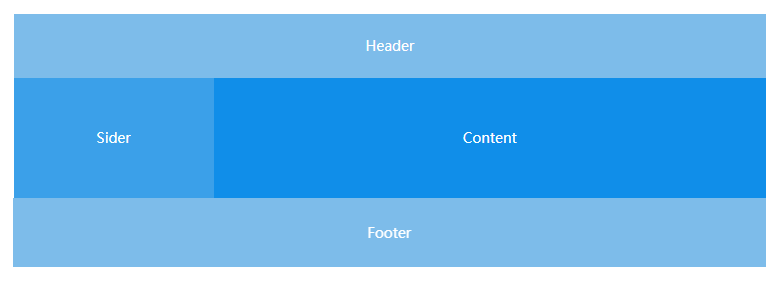
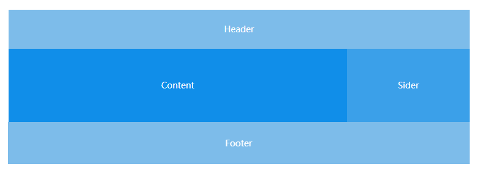
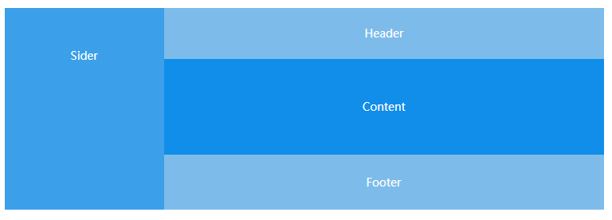

## 本章要点

[TOC]

## CONTENT

### 一. Ta4041布局简介

#### 1.1 layout布局

**组件概述**

- `Layout`：布局容器，其下可嵌套 `Header` `Sider` `Content` `Footer` 或 `Layout` 本身，可以放在任何父容器中。
- `Header`：顶部布局，自带默认样式，其下可嵌套任何元素，只能放在 `Layout` 中。
- `Sider`：侧边栏，自带默认样式及基本功能，其下可嵌套任何元素，只能放在 `Layout` 中。
- `Content`：内容部分，自带默认样式，其下可嵌套任何元素，只能放在 `Layout` 中。
- `Footer`：底部布局，自带默认样式，其下可嵌套任何元素，只能放在 `Layout` 中。

> 注意：采用 flex 布局实现，请注意浏览器兼容性问题。

**基本结构**

典型的页面布局。


```html
<template>
  <div>
    <ta-layout>
      <ta-layout-header>Header</ta-layout-header>
      <ta-layout-content>Content</ta-layout-content>
      <ta-layout-footer>Footer</ta-layout-footer>
    </ta-layout>
  </div>
</template>
```



```html
<template>
  <div>
    <ta-layout>
      <ta-layout-header>Header</ta-layout-header>
      <ta-layout>
        <ta-layout-sider>Sider</ta-layout-sider>
        <ta-layout-content>Content</ta-layout-content>
      </ta-layout>
      <ta-layout-footer>Footer</ta-layout-footer>
    </ta-layout>
  </div>
</template>
```



```html
<template>
  <div>
    <ta-layout>
      <ta-layout-header>Header</ta-layout-header>
      <ta-layout>
        <ta-layout-content>Content</ta-layout-content>
        <ta-layout-sider>Sider</ta-layout-sider>
      </ta-layout>
      <ta-layout-footer>Footer</ta-layout-footer>
    </ta-layout>
  </div>
</template>
```



```html
<template>
  <div>
    <ta-layout>
      <ta-layout-sider>Sider</ta-layout-sider>
      <ta-layout>
        <ta-layout-header>Header</ta-layout-header>
        <ta-layout-content>Content</ta-layout-content>
        <ta-layout-footer>Footer</ta-layout-footer>
      </ta-layout>
    </ta-layout>
  </div>
</template>
```

#### 1.2 grid栅格布局

#### 1.3 border布局

### 二. 示例项目界面原型分析

### 三. 页面整体布局设计

### 四. 交互设计

## 本章小结

本章主要引导配置Ta404前端框架开发所需的运行环境，初始化前端框架，并使用插件或示例代码的方式生成模块，为大家展示Ta404前端开发的简略流程，本章的重点在于：

- 框架初始化
- 示例模块搭建
- 插件使用
- 框架配置

