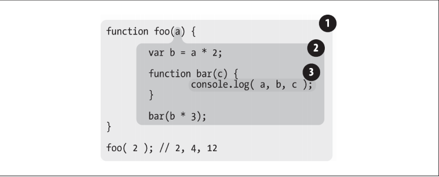

## 说明

> 《你不知道的JavaScript》学习笔记。

## 作用域的工作模型

- 第一种是最为普遍的，被大多数编程语言所采用的`词法作用域`。
- 另外一种叫作`动态作用域`，仍有一些编程语言在使用（比如 Bash 脚本、Perl 中的一些模式等）。

## 词法阶段

大部分标准语言编译器的第一个工作阶段叫作`词法化`（也叫单词化）。

> 简单地说，词法作用域就是定义在词法阶段的作用域。换句话说，词法作用域是由你在写代码时将变量和块作用域写在哪里来决定的，因此当词法分析器处理代码时会保持作用域不变（大部分情况下是这样的）。

举一个例子：

```js
function foo(a) {
    var b = a * 2;
    function bar(c) {
        console.log( a, b, c );
    }
    bar( b * 3 );
}
foo( 2 ); // 2, 4, 12
```

在这个例子中有三个逐级嵌套的作用域。如下图，可以把它想成几个不同层级的气泡



- `气泡1`：包含着整个全局作用域，其中只有一个标识符：foo。
- `气泡2`：包含着 foo 所创建的作用域，其中有三个标识符：a、bar 和 b。
- `气泡3`：包含着 bar 所创建的作用域，其中只有一个标识符：c。\

### 查找

> 作用域气泡的结构和互相之间的位置关系给引擎提供了足够的位置信息，引擎用这些信息来查找标识符的位置。

以上述例子为例：

当引擎执行 console.log(..) 声明，并查找 a、b 和 c 三个变量的引用。

- 首先从最内部的作用域，也就是 bar(..) 函数的作用域气泡开始查找。
- 如果引擎无法在这里找到 a，因此会去上一级到所嵌套的 foo(..) 的作用域中继续查找。
- 对于b，c也是同样的方式查找

**作用域查找会在找到第一个匹配的标识符时停止。**

**特殊情况：`遮蔽效应`**：

> 在多层的嵌套作用域中可以定义同名的标识符，这叫作`遮蔽效应`（内部的标识符“遮蔽”了外部的标识符）。

**注意**：

> NOTE：词法作用域查找只会查找一级标识符，比如 a、b 和 c。如果代码中引用了 foo.bar.baz，词法作用域查找只会试图查找 foo 标识符，找到这个变量后，对象属性访问规则会分别接管对 bar 和 baz 属性的访问。

## 欺骗词法

> 修改（欺骗）词法作用域的两种机制：eval 以及 with。但是欺骗词法作用域会导致性能下降。

### eval

**原理**：在执行 eval(..) 之后的代码时，引擎并不“知道”或“在意”前面的代码是以动态形式插入进来，并对词法作用域的环境进行修改的。引擎只会如往常地进行词法作用域查找。

1、例子：

```js
function foo(str, a) {
    eval( str ); // 欺骗！
    console.log( a, b );
}
var b = 2;
foo( "var b = 3;", 1 ); // 1, 3
```

例子分析：

- 1、eval(..) 调用中的 "var b = 3;"，实际上在 foo(..) 内部创建了一个变量 b，遮蔽了外部（全局）作用域中的同名变量。从而修改了 foo(..) 的词法作用域
- 2、当 console.log(..) 被执行时，会在 foo(..) 的内部同时找到 a 和 b，但是永远也无法找到外部的 b。

2、特殊例子：

> 在严格模式的程序中，eval(..) 在运行时有其自己的词法作用域，无法修改所在的作用域。

```js
function foo(str) {
    "use strict";
    eval( str );
    console.log( a ); // ReferenceError: a is not defined
}
foo( "var a = 2" );
```

### with

with 通常被当作重复引用同一个对象中的多个属性的快捷方式，可以不需要重复引用对象本身。

1、例子：

```js
var obj = {
    a: 1,
    b: 2,
    c: 3
}

// 单调乏味的重复 "obj"
obj.a = 2;
obj.b = 3;
obj.c = 4;

// 简单的快捷方式
with (obj) {
    a = 2;
    b = 3;
    c = 4;
}
```

2、再看一个例子：

```js
function foo(obj) {
    with (obj) {
        a = 2;
    }
}
var o1 = {
    a: 3
};
var o2 = {
    b: 3
};
foo( o1 );
console.log( o1.a ); // 2
foo( o2 );
console.log( o2.a ); // undefined
console.log( a ); // 2 (a 被泄漏到全局作用域上了！)
```

例子分析：

- 1、上面例子创建了 o1 和 o2 两个对象，o1 有 a 属性， o2 没有。
- 2、`foo()` 函数接收一个 obj 的参数，该参数是一个对象引用，并对这个对象执行了 `with(obj) {}`。
- 3、在 with 块内部，`a = 2` 实际上就是一个LHS引用，并将 2 赋值给 变量 a。
- 4、o1 传递进去，`a＝2` 赋值操作找到了 `o1.a` 并将 2 赋值给它
- 5、o2 传递进去，o2 并没有 a 属性，o2.a 保持 `undefined`。

那为什么with里的 a = 2 赋值操作创建了一个全局的变量 a ？

> 当传递 o2 给 with 时，with 所声明的作用域是 o2，而 o2 的作用域、foo(..) 的作用域和全局作用域中都没有找到标识符 a，因此当 `a＝2` 执行时，自动创建了一个全局变量（因为是非严格模式）。

### 性能

JavaScript 引擎会在编译阶段进行数项的性能优化。其中有些优化依赖于能够根据代码的词法进行静态分析，并预先确定所有变量和函数的定义位置，才能在执行过程中快速找到标识符。

但如果引擎在代码中发现了 eval(..) 或 with，它只能简单地假设关于标识符位置的判断都是无效的，因为无法在词法分析阶段明确知道 eval(..) 会接收到什么代码，这些代码会如何对作用域进行修改，也无法知道传递给 with 用来创建新词法作用域的对象的内容到底是什么。

**建议：不要使用 `eval(..)` 和 `with`。**
