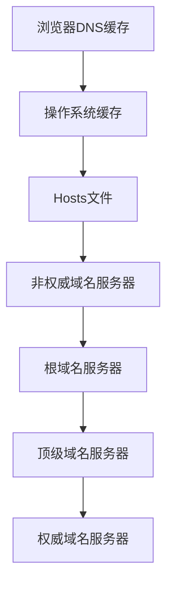

## 说明

> [《透视HTTP协议》](https://time.geekbang.org/column/intro/189)是 `罗剑锋` （奇虎360技术专家）在极客时间开的一门专栏课，笔者记录一下学习笔记，仅供参考。

## 域名的形式

1、域名是一个有层次的结构，是一串用`.`分隔的多个单词，最右边的被称为`顶级域名`，然后是`二级域名`，层级关系向左依次降低。

2、域名本质上还是个名字空间系统，使用多级域名就可以划分出不同的国家、地区、组织、公司、部门，每个域名都是独一无二的，可以作为一种身份的标识。

比如：极客时间的域名`time.geekbang.org`，`org`就是顶级域名，`geekbang`是二级域名，`time`则是主机名。

3、域名的总长度限制在253个字符以内，而每一级域名长度不能超过63个字符。

4、域名是大小写无关的，但是通常都使用小写的形式。

## 域名的解析

> 就像 `IP 地址`必须转换成 `MAC 地址`才能访问主机一样，`域名`也必须要转换成 `IP 地址`，这个过程就是`域名解析`。

DNS 架构图：

### DNS 的核心系统

> DNS 的核心系统：是一个三层的树状、分布式服务，基本对应域名的结构如下：

**1、根域名服务器（Root DNS Server）**：

> 管理顶级域名服务器，返回`com、net、cn`等顶级域名服务器的 IP 地址。

**2、顶级域名服务器（Top-level DNS Server）**：

> 管理各自域名下的权威域名服务器，比如 com 顶级域名服务器可以返回 apple.com 域名服务器的 IP 地址。

**3、权威域名服务器（Authoritative DNS Server）**：

> 管理自己域名下主机的 IP 地址，比如 apple.com 权威域名服务器可以返回 www.apple.com 的 IP 地址。

### 两种方法减压

**1、缓存**：

1）、许多大公司、网络运行商都会建立自己的 DNS 服务器，作为用户 DNS 查询的代理，代替用户访问核心 DNS 系统。

2）、这些“野生”服务器被称为`非权威域名服务器`。可以缓存之前的查询结果，如果已经有了记录，就无需再向根服务器发起查询，直接返回对应的 IP 地址。

比较知名的DNS有：

- [Google](https://baike.baidu.com/item/Google)：8.8.8.8
- [Microsoft](https://baike.baidu.com/item/%E5%BE%AE%E8%BD%AF?fromtitle=microsoft&fromid=125917)：4.2.2.1
- [CloudFlare](https://baike.baidu.com/item/Cloudflare/17359757?fr=aladdin)：1.1.1.1

**2、hosts文件**：

操作系统里也会对 DNS 解析结果做缓存，它里面有一个特殊的`主机映射`文件，通常是一个可编辑的文本：

- 在 Linux 里是`/etc/hosts`
- 在 Windows 里是`C:\WINDOWS\system32\drivers\etc\hosts`

如果操作系统在缓存里找不到 DNS 记录，就会找这个文件。

### DNS解析的过程

浏览器DNS缓存-->操作系统缓存-->Hosts文件-->非权威域名服务器（缓存DNS服务器，比如我们每家每户上网设置的DNS服务器）-->根域名服务器-->顶级域名服务器-->权威域名服务器（域名注册商的DNS服务器）。

DNS解析流程图（需要博客支持[mermaid](https://github.com/knsv/mermaid)，才能解析）：

## 域名的“新玩法”

**1、重定向**：

常用于服务器临时维护，DNS 修改内部的 IP 地址映射关系，保证业务服务正常运行。

**2、名字空间**：

使用开源软件搭建一个内部使用的DNS，作为名字服务器。这样我们开发的各种内部服务就都用域名来标记，发起网络通信时就不必在使用写死的 IP 地址。

**3、负载均衡**：

方式1：因为域名解析可以返回多个 IP 地址，所以一个域名可以对应多台主机，客户端收到多个 IP 地址后，就可以自己使用轮询算法依次向服务器发起请求，实现负载均衡。

方式2：域名解析可以配置内部的策略，返回离客户端最近的主机，或者返回当前服务质量最好的主机，这样在 DNS 端把请求分发到不同的服务器，实现负载均衡。

**4、恶意玩法**：

- `域名屏蔽`：对域名直接不解析，返回错误，让你无法拿到 IP 地址，也就无法访问网站
- `域名劫持`：也叫`域名污染`，你要访问 A 网站，但 DNS 给了你 B 网站。
